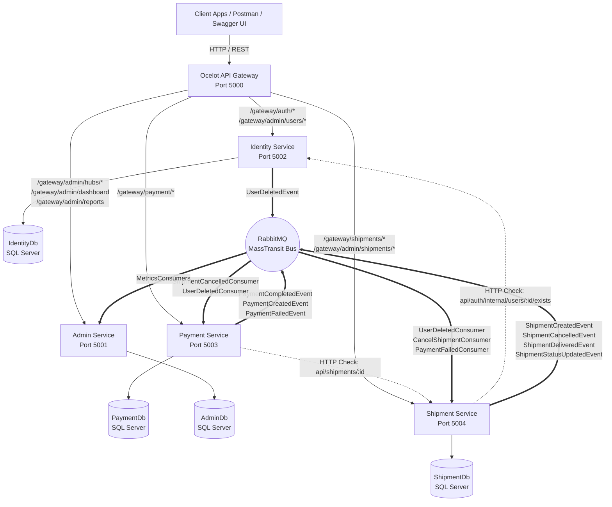
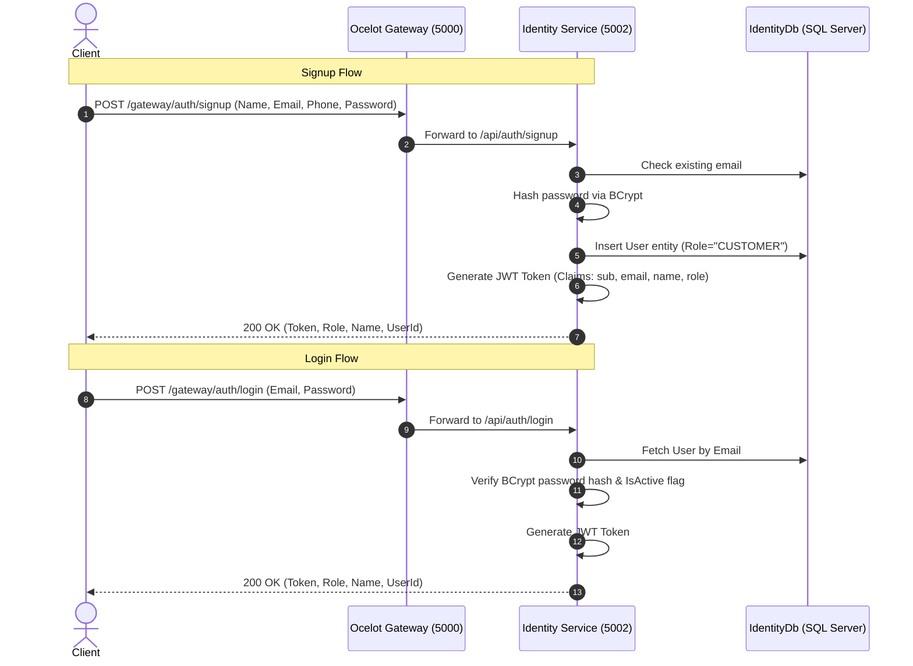
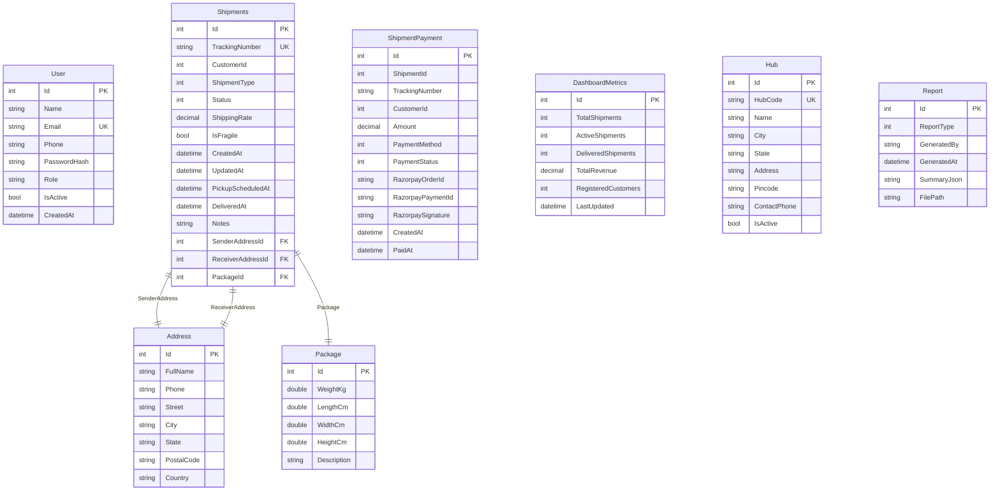
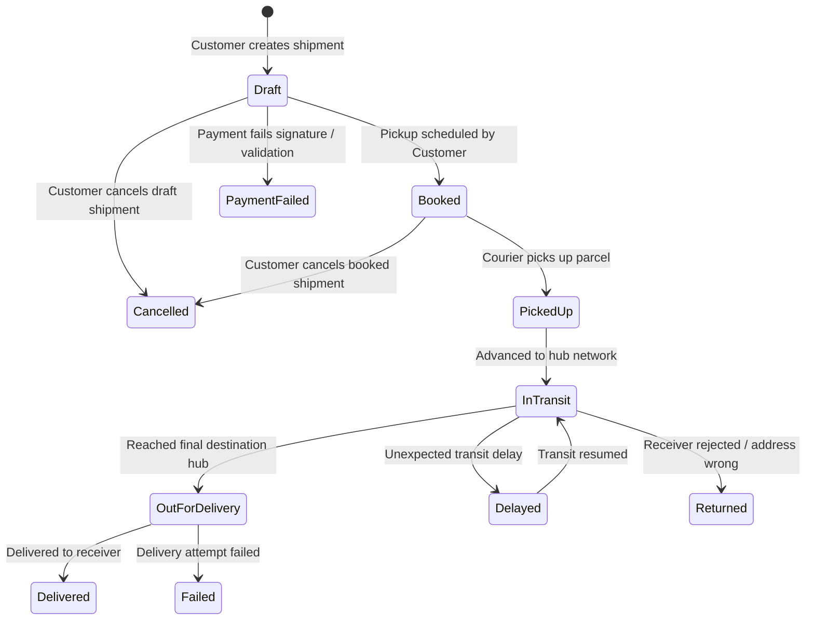
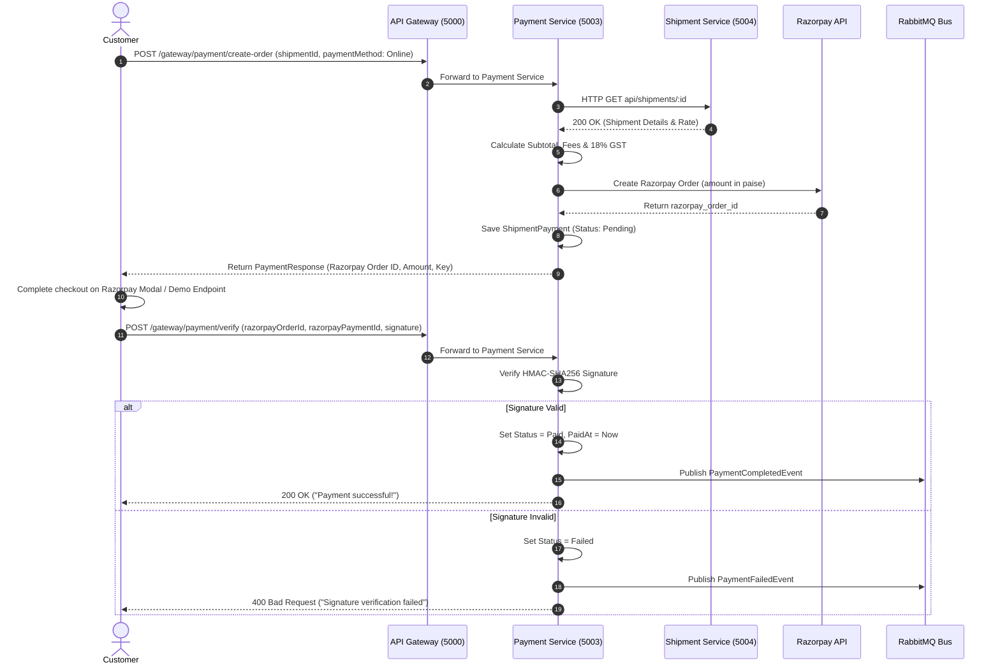
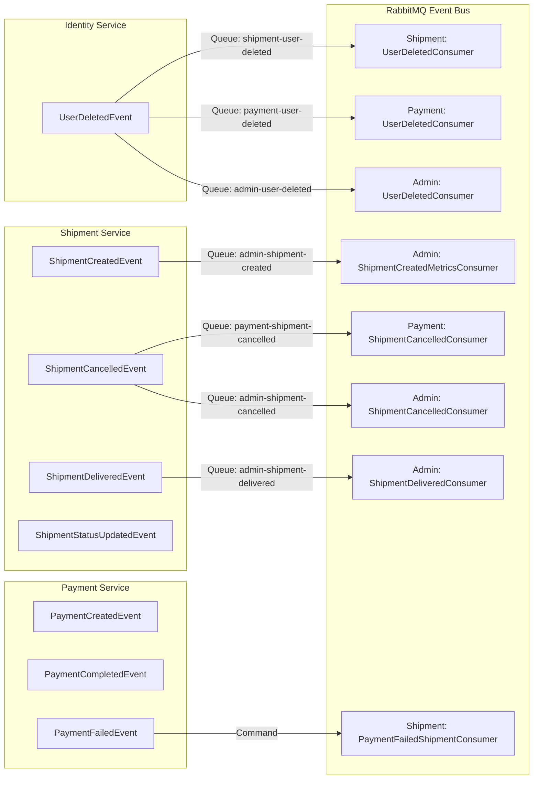
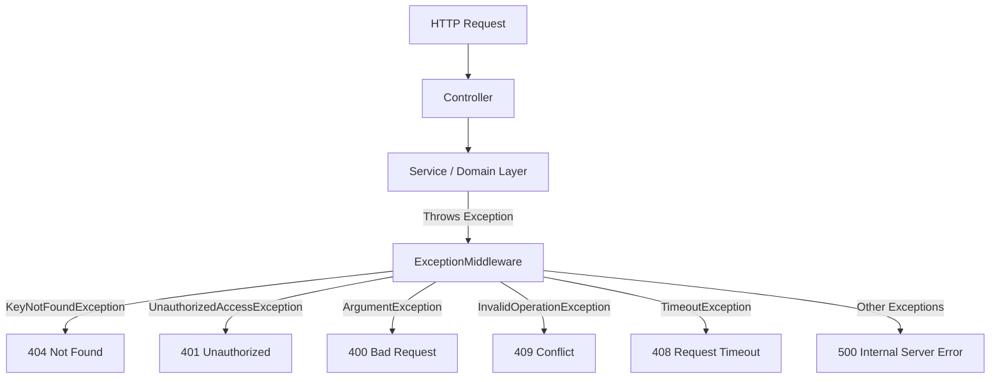

# SmartShip – Logistics Management System

An enterprise-grade, event-driven .NET 10 microservices platform for logistics operations, shipment lifecycle management, multi-service payment processing with Razorpay, and real-time administrative metrics aggregation.

---

## 1. Project Overview

### What SmartShip Is
**SmartShip** is a distributed, microservice-based logistics management system engineered to automate the end-to-end lifecycle of parcel delivery. It provides customer-facing capabilities for rate estimation, shipment booking, pickup scheduling, online and cash-on-delivery (COD) payment processing, and parcel tracking. Simultaneously, it provides administrative capabilities for managing logistics hubs, monitoring key performance metrics, generating operation reports, and controlling shipment status transitions across transit networks.

### What Problem It Solves
Legacy monolithic logistics solutions suffer from tight coupling, fragile deployment pipelines, and centralized performance bottlenecks during peak delivery volumes. SmartShip solves these issues by decoupling domain boundaries into scalable, independently deployable microservices. It replaces synchronous cross-domain dependencies with asynchronous event driven messaging via RabbitMQ, ensuring operational resilience, fault isolation, and high system availability.

### Who Uses It
* **Customers / Shippers**: Book shipments, schedule warehouse pickups, calculate rate quotes, pay online via Razorpay or choose Cash on Delivery (COD), manage profile details, track parcels in real time, and request cancellations.
* **Logistics Administrators / Hub Managers**: Provision and manage logistics hubs, monitor platform analytics (revenue, user growth, shipment metrics), manage customer accounts, update parcel statuses, and generate historical business reports.

### Main Business Workflow
1. **Account Setup**: Customer signs up, creating an account in `IdentityService`.
2. **Shipment Booking**: Customer requests a rate quote based on package weight and service type (Domestic, Express, Freight, International), then creates a draft shipment in `ShipmentService`.
3. **Payment Processing**: Customer initiates payment in `PaymentService`. For online payments, a Razorpay order is generated with itemized taxes (Fuel Surcharge, Handling Fee, Fragile Surcharge, GST), and verified using HMAC-SHA256 signature validation. For COD, a pending payment record is registered.
4. **Pickup Scheduling**: Customer schedules parcel pickup, advancing shipment status from `Draft` to `Booked`.
5. **Transit & Delivery Operations**: Logistics administrators advance shipment statuses (`Booked` -> `PickedUp` -> `InTransit` -> `OutForDelivery` -> `Delivered`). MassTransit events trigger real-time updates and metrics aggregations.
6. **Analytics & Metrics**: `AdminService` consumes domain events asynchronously to update real-time dashboard counts (total revenue, active shipments, delivered orders, customer counts).

### Why Microservices Are Used in SmartShip
* **Domain Autonomy**: Payment logic (Razorpay integrations, tax calculations) is completely isolated from shipment routing and identity credentials.
* **Independent Scalability**: High-frequency APIs like shipment tracking and payment verification can be scaled independently of low-frequency administrative reporting.
* **Fault Tolerance**: If the `AdminService` or `PaymentService` experiences downtime, customer registration and shipment creation in `IdentityService` and `ShipmentService` remain uninterrupted.
* **Database Isolation**: Database-per-service ensures strict data boundaries, preventing cross-domain schema coupling and direct database joins across boundaries.

> **30-Second Interview Summary**:
> "SmartShip is a distributed logistics platform built on .NET 10 microservices using ASP.NET Core Web API, Entity Framework Core with SQL Server, Ocelot API Gateway, and RabbitMQ via MassTransit. It features database-per-service architecture, JWT authentication with role-based access control, Razorpay online payments with COD support, and real-time event-driven administrative metrics processing. It handles the complete parcel lifecycle from draft creation and automated rate calculation to pickup scheduling, transit tracking, and delivery."

---

## 2. Key Features

- **Authentication and Authorization**: JWT token generation with HS256 signing, BCrypt password hashing, and role-based authorization (`CUSTOMER` vs `ADMIN`).
- **User Management**: Profile updates, active/inactive user state toggles, user deletion with asynchronous event cascades to downstream services.
- **Shipment Creation & Rate Calculation**: Automated rate calculation based on parcel weight (kg) and type (`Domestic`, `Express`, `Freight`, `International`), address validation, and unique tracking number generation (`SHP-YYYYMMDDHHMMSS-XXXX`).
- **Shipment Tracking**: Public/authenticated parcel tracking by tracking number or unique shipment ID.
- **Pickup Scheduling**: Automated state advancement from `Draft` to `Booked` upon customer pickup time selection.
- **Shipment Cancellation**: Customer self-service cancellation for `Draft` and `Booked` parcels with event publishing to trigger payment refund/cancellation workflows.
- **Logistics Hub Management**: CRUD operations for logistics hubs with active state filtering.
- **Payment Processing (Razorpay & COD)**: Razorpay order creation, HMAC-SHA256 signature verification, COD order registration, and itemized surcharge calculation (Base rate + Fuel Surcharge 5% + Handling Fee + Fragile Fee + COD Fee 1.5% + 18% GST).
- **Demo Payment Gateway Integration**: Dedicated testing endpoint (`POST /api/payment/demo-payment/{orderId}`) generating mock Razorpay payment IDs and valid HMAC signatures for sandbox testing.
- **Admin Dashboard Analytics**: Asynchronous real-time metrics aggregation tracking active shipments, delivered shipments, total revenue, and registered customer counts.
- **Business Report Generation**: Automated PDF/CSV-ready report generation for logistics performance.
- **Event-Driven Communication**: Asynchronous event publishing and consumption via RabbitMQ and MassTransit for decoupled cross-service side-effects.

---

## 3. Technology Stack

| Technology | Purpose |
| :--- | :--- |
| **C# 13 / .NET 10.0** | Primary development language and framework runtime |
| **ASP.NET Core Web API** | Core framework for high-performance RESTful microservices |
| **Entity Framework Core 10.0** | Object-Relational Mapper (ORM) for SQL Server database access |
| **Microsoft SQL Server** | Relational Database Management System (Database-per-service pattern) |
| **RabbitMQ** | Message Broker for asynchronous event publication and message queuing |
| **MassTransit 8.x** | Enterprise Service Bus library abstracting RabbitMQ exchanges and queues |
| **Ocelot API Gateway** | API Gateway providing reverse proxy routing, JWT authorization pass-through |
| **MMLib.SwaggerForOcelot** | Aggregated Swagger UI console combining OpenAPI specs across microservices |
| **JWT (JSON Web Tokens)** | Bearer token authentication and role-based claims verification |
| **BCrypt.Net-Next** | Cryptographic password hashing and verification algorithm |
| **Razorpay .NET SDK** | Payment gateway SDK for order creation and HMAC-SHA256 verification |
| **FluentValidation** | Declarative DTO request validation middleware |
| **Serilog** | Structured logging framework writing enriched logs to Console and Log Files |
| **xUnit** | Unit testing framework for test suites |
| **Moq** | Mocking library for isolating repository and service dependencies in tests |

---

## 4. System Architecture



### Architecture Component Responsibilities
* **API Gateway (`SmartShip.Gateway`)**: Single Entry Point for clients on port `5000`. Handles upstream path rewriting (`/gateway/*` -> `/api/*`), JWT Bearer token validation, and Swagger UI aggregation.
* **Identity Service (`Port 5002`)**: Owns `IdentityDb`. Handles user registration, authentication, JWT token issuance, profile management, and account status toggles.
* **Shipment Service (`Port 5004`)**: Owns `ShipmentDb`. Manages shipment booking, automated rate calculation, pickup scheduling, tracking number generation, and status state machine.
* **Payment Service (`Port 5003`)**: Owns `PaymentDb`. Handles Razorpay order creation, HMAC-SHA256 signature verification, tax/surcharge calculation, COD registration, and demo payments.
* **Admin Service (`Port 5001`)**: Owns `AdminDb`. Manages logistics hubs, generates business reports, and aggregate real-time dashboard analytics from domain events.
* **RabbitMQ / MassTransit**: Asynchronous message broker facilitating loose coupling, background side-effects, and eventual consistency across domain boundaries.
* **Shared Library (`SmartShip.Shared`)**: Contains shared event contracts and cross-cutting middleware (`ExceptionMiddleware`).

---

## 5. Microservices Breakdown

### Identity Service
* **Purpose**: User identity management, authentication, credential validation, and JWT token issuance.
* **Responsibilities**: Password hashing via BCrypt, user profile management, role assignment (`CUSTOMER`, `ADMIN`), active status control, publishing `UserDeletedEvent`.
* **Main APIs**: `POST /api/auth/signup`, `POST /api/auth/login`, `PUT /api/auth/profile`, `GET/PUT/DELETE /api/admin/users/{id}`, `GET /api/auth/internal/users/{id}/exists`.
* **Database**: `IdentityDb` (SQL Server) owning `Users` table.
* **Important Entities**: `User` (`Id`, `Name`, `Email`, `Phone`, `PasswordHash`, `Role`, `IsActive`, `CreatedAt`).
* **Auth Flow & Claims**: Generates JWT signed with HMAC-SHA256 containing `NameIdentifier`, `Email`, `Name`, and `Role` claims.
* **Events Published**: `UserDeletedEvent`.
* **Events Consumed**: None.

> **Interview Pitch**: "Identity Service is the security authority for SmartShip running on port 5002. It manages user credentials with BCrypt hashing, issues JWT tokens with custom role claims, and exposes internal validation endpoints for downstream services. When an admin deletes a user, it publishes a `UserDeletedEvent` to trigger data cleanup in Shipment and Payment services."

---

### Shipment Service
* **Purpose**: Parcel lifecycle management, shipping rate calculation, pickup scheduling, and tracking.
* **Responsibilities**: Validates active customer via Identity HTTP call, calculates distance/weight pricing rates, generates tracking numbers (`SHP-YYYYMMDDHHMMSS-XXXX`), handles state transitions (`Draft` -> `Booked` -> `PickedUp` -> `InTransit` -> `OutForDelivery` -> `Delivered`).
* **Main APIs**: `POST /api/shipments/create`, `GET /api/shipments/{id}`, `POST /api/shipments/{id}/schedule-pickup`, `GET /api/shipments/rate`, `PATCH /api/shipments/{id}/cancel`, `GET /api/shipments/by-tracking/{trackingNumber}`, `PUT /api/admin/shipments/status/{id}`.
* **Database**: `ShipmentDb` (SQL Server) owning `Shipments`, `Addresses`, and `Packages` tables.
* **Important Entities**: `Shipments`, `Address`, `Package`. Enums: `ShipmentStatus`, `ShipmentType`.
* **Events Published**: `ShipmentCreatedEvent`, `ShipmentCancelledEvent`, `ShipmentDeliveredEvent`, `ShipmentStatusUpdatedEvent`.
* **Events Consumed**: `UserDeletedConsumer`, `CancelShipmentConsumer`, `PaymentFailedShipmentConsumer`.

> **Interview Pitch**: "Shipment Service is the core domain service running on port 5004. It implements the shipment state machine, enforces business rules around status transitions, and automatically calculates rates based on parcel weight and shipping type. It coordinates synchronously with Identity Service for user validation and asynchronously publishes lifecycle events for payments and metrics."

---

### Payment Service
* **Purpose**: Financial transaction management, Razorpay gateway integration, tax/fee calculation, and COD handling.
* **Responsibilities**: Validates shipment ownership via internal HTTP call to Shipment Service, calculates itemized taxes (5% Fuel Surcharge, Handling Fee, Fragile Surcharge, 1.5% COD Fee, 18% GST), generates Razorpay orders, verifies HMAC-SHA256 signatures, provides mock demo payments, and processes refunds/cancellations.
* **Main APIs**: `POST /api/payment/create-order`, `POST /api/payment/verify`, `GET /api/payment/payment-status`, `GET /api/payment/shipment/{shipmentId}`, `GET /api/payment/my`, `GET /api/payment/all`, `POST /api/payment/demo-payment/{orderId}`.
* **Database**: `PaymentDb` (SQL Server) owning `ShipmentPayments` table.
* **Important Entities**: `ShipmentPayment`, `RazorpaySettings`. Enums: `PaymentMethod` (`Online`, `COD`), `PaymentStatus` (`Pending`, `Paid`, `Failed`, `Refunded`).
* **Events Published**: `PaymentCreatedEvent`, `PaymentCompletedEvent`, `PaymentFailedEvent`.
* **Events Consumed**: `ShipmentCancelledConsumer`, `ShipmentCancelledByCustomerConsumer`, `UserDeletedConsumer`.

> **Interview Pitch**: "Payment Service handles all financial transactions on port 5003. It integrates with Razorpay for online payments, calculates detailed tax and surcharge breakdowns, and supports Cash on Delivery. It verifies Razorpay HMAC SHA256 signatures for security and consumes cancellation events from RabbitMQ to handle status updates automatically."

---

### Admin Service
* **Purpose**: Executive dashboard analytics, logistics hub administration, and management reports.
* **Responsibilities**: Aggregates platform metrics asynchronously from domain events (total revenue, active shipments, delivered parcels, total customers), provisions logistics hubs, and generates operational reports.
* **Main APIs**: `GET /api/admin/dashboard`, `GET /api/admin/hubs/all-active`, `GET/PUT/DELETE /api/admin/hubs/{id}`, `POST /api/admin/hubs`, `POST /api/admin/reports`.
* **Database**: `AdminDb` (SQL Server) owning `DashboardMetrics`, `Hubs`, and `Reports` tables.
* **Important Entities**: `DashboardMetrics`, `Hub`, `Report`. Enum: `ReportType` (`Revenue`, `Shipments`, `Users`, `HubPerformance`).
* **Events Published**: None.
* **Events Consumed**: `UserCreatedConsumer`, `UserDeletedConsumer`, `ShipmentCreatedMetricsConsumer`, `ShipmentDeliveredConsumer`, `ShipmentCancelledConsumer`.

> **Interview Pitch**: "Admin Service manages administrative operational data on port 5001. Rather than querying operational databases directly, it consumes MassTransit domain events to incrementally update its own `DashboardMetrics` table in real time, demonstrating eventual consistency and zero cross-service database coupling."

---

## 6. Project Structure

```
SmartShip/
├── Gateway/
│   └── SmartShip.Gateway/                      # Ocelot API Gateway Project (Port 5000)
│       ├── ocelot.json                         # Route rules, downstream ports, Swagger keys
│       └── Program.cs                          # Serilog, Ocelot, JWT Bearer, SwaggerUI setup
├── Services/
│   ├── AdminService/                           # Admin Microservice (Port 5001)
│   │   ├── Core/
│   │   │   ├── SmartShip.Admin.Application/    # Application layer (Services, DTOs, Validators)
│   │   │   └── SmartShip.Admin.Domain/         # Domain layer (Entities, Enums)
│   │   ├── Infrastructure/
│   │   │   └── SmartShip.Admin.Infrastructure/ # Infrastructure (DbContext, Repos, Consumers)
│   │   ├── Presentation/
│   │   │   └── SmartShip.Admin.API/            # Web API Controllers, Program.cs
│   │   └── Tests/
│   │       └── SmartShip.Admin.Tests/          # xUnit Test suite
│   ├── IdentityService/                        # Identity Microservice (Port 5002)
│   │   ├── Core/
│   │   │   ├── SmartShip.Identity.Application/ # Application layer (Auth, User Services, DTOs)
│   │   │   └── SmartShip.Identity.Domain/      # Domain layer (User Entity)
│   │   ├── Infrastructure/
│   │   │   └── SmartShip.Identity.Infrastructure/ # DbContext, Repositories, Migrations
│   │   ├── Presentation/
│   │   │   └── SmartShip.Identity.API/         # AuthController, UsersController, Program.cs
│   │   └── Tests/
│   │       └── SmartShip.Identity.Tests/       # xUnit Test suite
│   ├── PaymentService/                         # Payment Microservice (Port 5003)
│   │   ├── Core/
│   │   │   ├── SmartShip.Payment.Application/  # Application layer (PaymentService, Razorpay)
│   │   │   └── SmartShip.Payment.Domain/       # Domain layer (ShipmentPayment Entity, Enums)
│   │   ├── Infrastructure/
│   │   │   └── SmartShip.Payment.Infrastructure/ # DbContext, Repositories, MassTransit Consumers
│   │   ├── Presentation/
│   │   │   └── SmartShip.Payment.API/          # PaymentController, Program.cs
│   │   └── Tests/
│   │       └── SmartShip.Payment.Tests/        # xUnit Test suite
│   └── ShipmentService/                        # Shipment Microservice (Port 5004)
│       ├── Core/
│       │   ├── SmartShip.Shipment.Application/ # Application layer (ShipmentService, DTOs)
│       │   └── SmartShip.Shipment.Domain/      # Domain layer (Shipments, Address, Package)
│       ├── Infrastructure/
│       │   └── SmartShip.Shipment.Infrastructure/ # DbContext, Repositories, Consumers
│       ├── Presentation/
│       │   └── SmartShip.Shipment.API/         # Controllers, Program.cs
│       └── Tests/
│           └── SmartShip.Shipment.Tests/       # xUnit Test suite
└── SmartShip.Shared/                           # Shared Class Library
    ├── Events/                                 # Shared MassTransit Event Contracts
    └── Middleware/                             # ExceptionMiddleware global handler
```

### Layer Responsibilities & Rationale
* **Domain Layer (`Core/*.Domain`)**: Contains plain domain entities and enums. Contains no dependencies on external libraries or databases, preserving core business rules.
* **Application Layer (`Core/*.Application`)**: Defines interfaces, DTOs, service implementations, and FluentValidation validators. Implements application use cases.
* **Infrastructure Layer (`Infrastructure/*`)**: Implements EF Core `DbContext`, repository implementations, Unit of Work, and MassTransit event consumers. Isolates database and messaging tech details.
* **Presentation Layer (`Presentation/*.API`)**: Contains API Controllers, dependency injection registration, and HTTP middleware configuration. Exposes REST API endpoints.
* **Shared Project (`SmartShip.Shared`)**: Holds cross-cutting event contracts and global middleware to eliminate code duplication across microservices.

---

## 7. Architecture Patterns

### 1. Clean / Onion Architecture
* **What it is**: Separation of software into concentric layers where dependencies point inward toward domain abstractions.
* **In SmartShip**: Applied in all four microservices (`Domain` <- `Application` <- `Infrastructure` & `API`).
* **Why useful**: Prevents framework or database lock-in; allows core domain logic to be unit tested without database dependencies.
* **Interview Explanation**: "Clean Architecture decouples our core domain rules from database and framework implementations. In SmartShip, our Domain layer has zero dependencies, ensuring business rules remain pure and fully testable."

### 2. Repository Pattern
* **What it is**: Abstraction layer between data access logic and business logic.
* **In SmartShip**: `IUserRepository`, `IShipmentRepository`, `IPaymentRepository`, `IHubRepository`.
* **Why useful**: Encapsulates data retrieval queries and allows mocking of persistence during unit testing.
* **Interview Explanation**: "The Repository pattern abstracts LINQ queries and DbContext interactions behind interfaces like `IShipmentRepository`, making our service logic cleaner and easy to unit test with Moq."

### 3. Unit of Work Pattern
* **What it is**: Manages a single database transaction across multiple repository operations.
* **In SmartShip**: `IUnitOfWork` exposing `SaveChangesAsync()` across services.
* **Why useful**: Ensures atomic commits so that related entity changes succeed or fail together.
* **Interview Explanation**: "Unit of Work coordinates work across multiple repositories under a single EF Core transaction, ensuring atomic updates when saving related entities like Shipments, Addresses, and Packages."

### 4. Data Transfer Object (DTO) Pattern
* **What it is**: Plain objects used to pass data between software layers and API clients.
* **In SmartShip**: `SignupRequest`, `CreateShipmentRequest`, `ShipmentResponse`, `CreateOrderRequest`.
* **Why useful**: Prevents domain entity exposure over APIs, avoids circular reference serialization, and enforces input contract validation.
* **Interview Explanation**: "DTOs decouple external API response schemas from internal database tables, preventing over-posting security issues and avoiding circular serialization reference errors."

### 5. Dependency Injection & Inversion
* **What it is**: Providing object dependencies from the outside rather than instantiating them internally.
* **In SmartShip**: Built-in ASP.NET Core DI container registering services via `AddScoped` and `AddSingleton`.
* **Why useful**: Promotes loose coupling, single responsibility, and mock injection during testing.
* **Interview Explanation**: "Dependency Injection allows our controllers and services to depend on abstractions like `IShipmentService` rather than concrete classes, enabling seamless unit testing and flexible service lifetime management."

### 6. Global Exception Handling Middleware
* **What it is**: Pipeline component that catches unhandled exceptions centrally.
* **In SmartShip**: `ExceptionMiddleware` in `SmartShip.Shared`.
* **Why useful**: Converts C# exceptions (`KeyNotFoundException`, `UnauthorizedAccessException`) into standardized HTTP error JSON payloads.
* **Interview Explanation**: "Our global middleware catches unhandled application exceptions centrally, translating domain exceptions into standard HTTP status codes like 404 Not Found or 401 Unauthorized without cluttering controllers with try-catch blocks."

---

## 8. Authentication and Authorization

### Signup & Login Sequence


### JWT Structure & Claims
* **Algorithm**: HMAC-SHA256 (`SymmetricSecurityKey`).
* **Token Issuer**: Configured in `appsettings.json` (`JwtSettings:Issuer`).
* **Token Audience**: Configured in `appsettings.json` (`JwtSettings:Audience`).
* **Claims**:
  * `ClaimTypes.NameIdentifier` / `userId`: Unique integer User ID.
  * `ClaimTypes.Email`: User email address.
  * `ClaimTypes.Name`: User full name.
  * `ClaimTypes.Role`: `CUSTOMER` or `ADMIN`.

### Role-Based Access Control
* **`[Authorize]`**: Enforces valid JWT token presence.
* **`[Authorize(Roles = "CUSTOMER")]`**: Protects endpoints like `/api/shipments/create`, `/api/payment/create-order`, `/api/payment/verify`.
* **`[Authorize(Roles = "ADMIN")]`**: Protects administrative endpoints like `/api/admin/dashboard`, `/api/admin/hubs`, `/api/admin/users/{id}`, `/api/admin/shipments/status/{id}`.

---

## 9. API Gateway Architecture

Ocelot API Gateway (`SmartShip.Gateway`) runs on **Port 5000** and serves as the single unified entry point for all client applications.

### Gateway Routing Table (`ocelot.json`)

| Upstream Path Pattern | Upstream Method | Downstream Path Pattern | Downstream Service | Downstream Port | Authentication |
| :--- | :--- | :--- | :--- | :--- | :--- |
| `/gateway/auth/login` | POST | `/api/auth/login` | Identity Service | 5002 | No |
| `/gateway/auth/signup` | POST | `/api/auth/signup` | Identity Service | 5002 | No |
| `/gateway/auth/profile` | PUT | `/api/auth/profile` | Identity Service | 5002 | Bearer JWT |
| `/gateway/admin/users/{id}` | GET, PUT, DELETE | `/api/admin/users/{id}` | Identity Service | 5002 | Bearer JWT (ADMIN) |
| `/gateway/admin/dashboard` | GET | `/api/admin/dashboard` | Admin Service | 5001 | Bearer JWT (ADMIN) |
| `/gateway/admin/hubs` | POST | `/api/admin/hubs` | Admin Service | 5001 | Bearer JWT (ADMIN) |
| `/gateway/admin/hubs/all-active`| GET | `/api/admin/hubs/all-active` | Admin Service | 5001 | Bearer JWT (ADMIN) |
| `/gateway/admin/hubs/{id}` | GET, PUT, DELETE | `/api/admin/hubs/{id}` | Admin Service | 5001 | Bearer JWT (ADMIN) |
| `/gateway/admin/reports` | POST | `/api/admin/reports` | Admin Service | 5001 | Bearer JWT (ADMIN) |
| `/gateway/shipments/create` | POST | `/api/shipments/create` | Shipment Service | 5004 | Bearer JWT (CUSTOMER) |
| `/gateway/shipments/{id}` | GET | `/api/shipments/{id}` | Shipment Service | 5004 | Bearer JWT |
| `/gateway/shipments/{id}/schedule-pickup` | POST | `/api/shipments/{id}/schedule-pickup` | Shipment Service | 5004 | Bearer JWT (CUSTOMER) |
| `/gateway/shipments/rate` | GET | `/api/shipments/rate` | Shipment Service | 5004 | Bearer JWT (CUSTOMER) |
| `/gateway/shipments/{id}/cancel` | PATCH | `/api/shipments/{id}/cancel` | Shipment Service | 5004 | Bearer JWT (CUSTOMER) |
| `/gateway/shipments/by-tracking/{trackingNumber}` | GET | `/api/shipments/by-tracking/{trackingNumber}` | Shipment Service | 5004 | Bearer JWT |
| `/gateway/admin/shipments/status/{id}` | PUT | `/api/admin/shipments/status/{id}` | Shipment Service | 5004 | Bearer JWT (ADMIN) |
| `/gateway/payment/create-order` | POST | `/api/payment/create-order` | Payment Service | 5003 | Bearer JWT (CUSTOMER) |
| `/gateway/payment/verify` | POST | `/api/payment/verify` | Payment Service | 5003 | Bearer JWT (CUSTOMER) |
| `/gateway/payment/demo-payment/{orderId}` | POST | `/api/payment/demo-payment/{orderId}` | Payment Service | 5003 | Bearer JWT (CUSTOMER) |
| `/gateway/payment/payment-status` | GET | `/api/payment/payment-status` | Payment Service | 5003 | Bearer JWT (ADMIN) |
| `/gateway/payment/shipment/{shipmentId}` | GET | `/api/payment/shipment/{shipmentId}` | Payment Service | 5003 | Bearer JWT |
| `/gateway/payment/my` | GET | `/api/payment/my` | Payment Service | 5003 | Bearer JWT (CUSTOMER) |
| `/gateway/payment/all` | GET | `/api/payment/all` | Payment Service | 5003 | Bearer JWT (ADMIN) |

---

## 10. Database Design

SmartShip enforces a strict **Database-per-Service** pattern using EF Core Code-First migrations with SQL Server.



### Database Isolation Rationale
Each service maintains complete autonomy over its underlying database. No microservice has SQL read/write permissions on another microservice's database. Cross-domain relationships (e.g., `Shipments.CustomerId` referencing `User.Id`, or `ShipmentPayment.ShipmentId` referencing `Shipments.Id`) are maintained strictly as logical integer identifiers verified via HTTP REST APIs or synchronized via MassTransit events.

---

## 11. Shipment Lifecycle

A shipment progresses through a strictly validated state machine managed by `ShipmentService`.



### Shipment Status Enumeration (`ShipmentStatus`)
- **`Draft` (0)**: Initial state created upon booking request.
- **`Booked` (1)**: Pickup time scheduled by customer; ready for courier pickup.
- **`PickedUp` (2)**: Courier has collected package from sender address.
- **`InTransit` (3)**: Parcel is moving through regional hub networks.
- **`OutForDelivery` (4)**: Parcel loaded on delivery vehicle for final leg.
- **`Delivered` (5)**: Successfully handed over to receiver.
- **`Delayed` (6)**: Experiencing operational delay in network.
- **`Failed` (7)**: Delivery attempt unsuccessful.
- **`Returned` (8)**: Parcel returned to sender.
- **`Cancelled` (9)**: Cancelled by customer or auto-cancelled due to payment failure.
- **`PaymentFailed` (10)**: Marked when payment verification fails.

---

## 12. Payment Flow Architecture

SmartShip supports both **Razorpay Online Payments** and **Cash on Delivery (COD)** with itemized tax and surcharge calculations.

### Itemized Price Calculation Formula
$$\text{Subtotal} = \text{Base Rate} + \text{Fuel Surcharge (5\%)} + \text{Handling Fee} + \text{Fragile Fee} + \text{COD Fee (1.5\%)}$$
$$\text{Total Amount} = \text{Subtotal} + \text{GST (18\%)}$$

Where:
* `Handling Fee` = ₹120 for `International`, ₹50 for `Domestic`/`Express`/`Freight`.
* `Fragile Fee` = ₹80 if `IsFragile = true`, else ₹0.
* `COD Fee` = 1.5% of Base Rate if `PaymentMethod == COD`, else ₹0.
* `GST` = 18% applied to Subtotal.

### Online Razorpay Payment Workflow


---

## 13. Event-Driven Architecture

MassTransit with RabbitMQ powers asynchronous cross-service communication in SmartShip.



### Event Catalog Table

| Event / Command Name | Publisher Service | Consumer Service(s) | Queue Name | Business Side Effect |
| :--- | :--- | :--- | :--- | :--- |
| `UserCreatedEvent` | Identity Service | Admin Service | `admin-user-created` | Increments `RegisteredCustomers` count in `DashboardMetrics`. |
| `UserDeletedEvent` | Identity Service | Shipment, Payment, Admin | `shipment-user-deleted`, `payment-user-deleted`, `admin-user-deleted` | Purges customer shipments/payments and decrements user count. |
| `ShipmentCreatedEvent` | Shipment Service | Admin Service | `admin-shipment-created` | Increments `TotalShipments` & `ActiveShipments` metrics. |
| `ShipmentCancelledEvent` | Shipment Service | Payment, Admin | `payment-shipment-cancelled`, `admin-shipment-cancelled` | Flags payments as cancelled and updates admin metrics. |
| `ShipmentCancelledByCustomerEvent` | Shipment Service | Payment Service | `payment-shipment-cancelled-by-customer` | Triggers payment refund/cancellation workflow. |
| `ShipmentDeliveredEvent` | Shipment Service | Admin Service | `admin-shipment-delivered` | Increments `DeliveredShipments` count and decrements active count. |
| `ShipmentStatusUpdatedEvent` | Shipment Service | Logistics Network | Event Exchange | Logs transit history across hubs. |
| `PaymentCreatedEvent` | Payment Service | Admin / Shipment | Queue Receiver | Registers payment creation event. |
| `PaymentCompletedEvent` | Payment Service | Admin Service | Event Exchange | Increments `TotalRevenue` metric in `DashboardMetrics`. |
| `PaymentFailedEvent` | Payment Service | Shipment Service | Command Exchange | Triggers `PaymentFailedShipmentConsumer` to mark status as `PaymentFailed`. |
| `CancelShipmentCommand` | Payment / System | Shipment Service | `shipment-cancel-command` | Auto-cancels draft shipment upon payment failure. |

---

## 14. Important End-to-End Workflows

### 1. Customer Registration
`Client` -> `Gateway` (`POST /gateway/auth/signup`) -> `IdentityService` -> Hashes password via BCrypt -> Inserts into `IdentityDb.Users` -> Generates JWT -> Returns Token to Client.

### 2. Customer Login
`Client` -> `Gateway` (`POST /gateway/auth/login`) -> `IdentityService` -> Queries `IdentityDb.Users` -> Verifies BCrypt hash -> Generates JWT with claims -> Returns Token.

### 3. Create Shipment
`Client` -> `Gateway` (`POST /gateway/shipments/create`) -> `ShipmentService` -> HTTP GET to `IdentityService` to validate customer active state -> Calculates base shipping rate -> Saves `SenderAddress`, `ReceiverAddress`, `Package`, `Shipment` to `ShipmentDb` -> Publishes `ShipmentCreatedEvent` -> `AdminService` consumes event to update metrics -> Returns `ShipmentResponse`.

### 4. Create Online Payment Order
`Client` -> `Gateway` (`POST /gateway/payment/create-order`) -> `PaymentService` -> HTTP GET to `ShipmentService` to verify ownership & fetch shipping rate -> Calculates itemized subtotal (Fuel Surcharge + Handling + Fragile + GST) -> Calls Razorpay API to generate Order ID -> Saves `ShipmentPayment` to `PaymentDb` (Status: `Pending`) -> Returns Razorpay Order ID & Key.

### 5. Verify Payment
`Client` -> `Gateway` (`POST /gateway/payment/verify`) -> `PaymentService` -> Validates HMAC-SHA256 signature using Razorpay Secret -> Updates `PaymentStatus = Paid` -> Publishes `PaymentCompletedEvent` -> `AdminService` updates `TotalRevenue` -> Returns Success response.

### 6. Schedule Pickup
`Client` -> `Gateway` (`POST /gateway/shipments/{id}/schedule-pickup`) -> `ShipmentService` -> Verifies customer ownership -> Updates `PickupScheduledAt` and advances `Status` from `Draft` to `Booked` -> Publishes `ShipmentStatusUpdatedEvent` -> Returns Success message.

### 7. Shipment Tracking
`Client` -> `Gateway` (`GET /gateway/shipments/by-tracking/{trackingNumber}`) -> `ShipmentService` -> Queries `ShipmentDb` by `TrackingNumber` with Address & Package inclusions -> Returns full parcel response.

### 8. Cancel Shipment
`Client` -> `Gateway` (`PATCH /gateway/shipments/{id}/cancel`) -> `ShipmentService` -> Validates shipment is in `Draft` or `Booked` state -> Updates status to `Cancelled` -> Publishes `ShipmentCancelledEvent` -> `PaymentService` updates payment status to `Refunded`/`Cancelled` -> `AdminService` decrements active shipment metric.

### 9. Admin Dashboard Metrics
`Admin` -> `Gateway` (`GET /gateway/admin/dashboard`) -> `AdminService` -> Reads pre-aggregated metrics from `AdminDb.DashboardMetrics` -> Returns `TotalShipments`, `ActiveShipments`, `DeliveredShipments`, `TotalRevenue`, `RegisteredCustomers`.

### 10. Admin Hub Creation
`Admin` -> `Gateway` (`POST /gateway/admin/hubs`) -> `AdminService` -> Validates `CreateHubRequest` via FluentValidation -> Inserts new `Hub` entity into `AdminDb` -> Returns created `HubDTO`.

---

## 15. API Reference Catalog

### Identity Service APIs (`Port 5002`)

| Method | Gateway Endpoint | Purpose | Authorization | Request Body | Response Payload |
| :--- | :--- | :--- | :--- | :--- | :--- |
| `POST` | `/gateway/auth/signup` | Register new user account | None | `SignupRequest` | `AuthResponse` |
| `POST` | `/gateway/auth/login` | Authenticate user & get JWT | None | `LoginRequest` | `AuthResponse` |
| `PUT` | `/gateway/auth/profile` | Update current user profile | `Bearer JWT` | `UpdateMyProfileRequest` | `{ message }` |
| `GET` | `/gateway/admin/users/{id}` | Get user details by ID | `Bearer ADMIN` | None | `UserDto` |
| `PUT` | `/gateway/admin/users/{id}` | Update active status | `Bearer ADMIN` | `UpdateUserRequest` | `{ message }` |
| `DELETE`| `/gateway/admin/users/{id}` | Delete user account | `Bearer ADMIN` | None | `{ message }` |

### Shipment Service APIs (`Port 5004`)

| Method | Gateway Endpoint | Purpose | Authorization | Request Body | Response Payload |
| :--- | :--- | :--- | :--- | :--- | :--- |
| `POST` | `/gateway/shipments/create` | Book new parcel shipment | `Bearer CUSTOMER` | `CreateShipmentRequest` | `ShipmentResponse` |
| `GET` | `/gateway/shipments/{id}` | Get shipment details by ID | `Bearer JWT` | None | `ShipmentResponse` |
| `POST` | `/gateway/shipments/{id}/schedule-pickup` | Schedule pickup time | `Bearer CUSTOMER` | `SchedulePickupRequest` | `{ message }` |
| `GET` | `/gateway/shipments/rate` | Get instant shipping quote | `Bearer CUSTOMER` | Query: `weight, type` | `{ rate }` |
| `PATCH`| `/gateway/shipments/{id}/cancel` | Cancel draft/booked shipment| `Bearer CUSTOMER` | `CancelShipmentRequest` | `{ message }` |
| `GET` | `/gateway/shipments/by-tracking/{trackingNumber}` | Track parcel by tracking # | `Bearer JWT` | None | `ShipmentResponse` |
| `PUT` | `/gateway/admin/shipments/status/{id}` | Advance parcel transit status | `Bearer ADMIN` | `UpdateStatusRequest` | `{ message }` |

### Payment Service APIs (`Port 5003`)

| Method | Gateway Endpoint | Purpose | Authorization | Request Body | Response Payload |
| :--- | :--- | :--- | :--- | :--- | :--- |
| `POST` | `/gateway/payment/create-order` | Create Razorpay/COD payment order | `Bearer CUSTOMER` | `CreateOrderRequest` | `PaymentResponse` |
| `POST` | `/gateway/payment/verify` | Verify Razorpay HMAC signature | `Bearer CUSTOMER` | `VerifyPaymentRequest` | `PaymentResponse` |
| `POST` | `/gateway/payment/demo-payment/{orderId}` | Generate mock payment signature | `Bearer CUSTOMER` | None | `DemoPaymentResponse` |
| `GET` | `/gateway/payment/payment-status` | Lookup payment status | `Bearer ADMIN` | Query: `orderId, shipmentId` | `PaymentResponse` |
| `GET` | `/gateway/payment/shipment/{shipmentId}` | Get payment by shipment ID | `Bearer JWT` | None | `PaymentResponse` |
| `GET` | `/gateway/payment/my` | Get user payment history | `Bearer CUSTOMER` | None | `List<PaymentResponse>` |
| `GET` | `/gateway/payment/all` | Get all system payments | `Bearer ADMIN` | None | `List<PaymentResponse>` |

### Admin Service APIs (`Port 5001`)

| Method | Gateway Endpoint | Purpose | Authorization | Request Body | Response Payload |
| :--- | :--- | :--- | :--- | :--- | :--- |
| `GET` | `/gateway/admin/dashboard` | Get real-time system metrics | `Bearer ADMIN` | None | `DashboardMetricsDTO` |
| `GET` | `/gateway/admin/hubs/all-active` | Get all active logistics hubs | `Bearer ADMIN` | None | `List<HubDTO>` |
| `GET` | `/gateway/admin/hubs/{id}` | Get hub details by ID | `Bearer ADMIN` | None | `HubDTO` |
| `POST` | `/gateway/admin/hubs` | Create new logistics hub | `Bearer ADMIN` | `CreateHubRequest` | `HubDTO` |
| `PUT` | `/gateway/admin/hubs/{id}` | Update logistics hub | `Bearer ADMIN` | `UpdateHubRequest` | `"Updated Successfully"` |
| `DELETE`| `/gateway/admin/hubs/{id}` | Delete logistics hub | `Bearer ADMIN` | None | `{ message }` |
| `POST` | `/gateway/admin/reports` | Generate system report | `Bearer ADMIN` | `ReportRequest` | `ReportDTO` |

---

## 16. Error Handling Strategy

SmartShip enforces consistent global exception handling across all microservices using `ExceptionMiddleware` in `SmartShip.Shared`.



### Standardized Error JSON Payload
```json
{
  "statusCode": 404,
  "message": "Shipment 1025 not found.",
  "timestamp": "16-Aug-2026 09:15 PM"
}
```

---

## 17. Structured Logging Architecture

SmartShip incorporates **Serilog** across all microservices and the API Gateway, enriching log messages with ambient context (`Application`, `Environment`, `RequestMethod`, `RequestPath`, `StatusCode`, `Elapsed`).

### Log Output Configuration (`appsettings.json`)
Logs are written concurrently to the **Console** and rotating **Log Files** under `./Logs/log-YYYYMMDD.log`.

```json
"Serilog": {
  "MinimumLevel": {
    "Default": "Information",
    "Override": {
      "Microsoft": "Warning",
      "System": "Warning"
    }
  }
}
```

### Sample Enriched Serilog Output
```text
[2026-08-16 21:04:12 INF] [IdentityService] User created successfully: customer@smartship.com (ID: 42)
[2026-08-16 21:04:15 INF] [ShipmentService] Rate calculated: 1680.00 | Type: Domestic | Weight: 21kg
[2026-08-16 21:04:18 INF] [PaymentService] Payment verified -> SHP-20260816210415-4921 Paid at 16-Aug 09:04 PM
[2026-08-16 21:04:19 INF] [Gateway] GATEWAY POST /gateway/payment/verify -> 200 in 14.5210ms
```

---

## 18. Security Architecture & Controls

- **JWT Authentication**: Validates Signature, Issuer, Audience, and Lifetime.
- **Password Protection**: Cryptographic password hashing using `BCrypt.Net.BCrypt.HashPassword` with work factor salt.
- **Razorpay Signature Validation**: Verifies payment integrity by computing HMAC-SHA256 over `orderId + "|" + paymentId` using the configured Razorpay Secret Key.
- **Role-Based Authorization**: Strict segregation of `CUSTOMER` and `ADMIN` endpoint permissions.
- **Input DTO Validation**: Automatic model validation using `FluentValidation` prior to execution.
- **Internal Microservice Validation**: `ShipmentService` validates customer existence against `IdentityService` via internal HTTP call (`api/auth/internal/users/{id}/exists`).

---

## 19. Testing Suite

The repository contains four dedicated xUnit test projects utilizing **Moq** for dependency isolation and **EF Core InMemory** for database context simulation.

### Test Projects Overview
- `SmartShip.Identity.Tests`: 30 Unit Tests covering `AuthController`, `UsersController`, `AuthService`, and `UserService`. (100% Passing)
- `SmartShip.Admin.Tests`: 24 Unit Tests covering `AdminController`, `AdminService`, `HubRepository`, and `ReportRepository`. (100% Passing)
- `SmartShip.Shipment.Tests`: Tests covering `ShipmentsController` and `ShipmentService`.
- `SmartShip.Payment.Tests`: Tests covering `PaymentController` and `PaymentService`.

### Executing Test Suite
```bash
# Execute all tests across the solution
dotnet test
```

---

## 20. Appsettings & Configuration Management

Each microservice contains sanitized configuration files. Secret placeholders are used below:

### Gateway `appsettings.json`
```json
{
  "JwtSettings": {
    "Key": "<YOUR_JWT_SECRET_KEY_MIN_32_CHARS>",
    "Issuer": "SmartShipIdentity",
    "Audience": "SmartShipClients"
  }
}
```

### Microservice `appsettings.json` Example
```json
{
  "ConnectionStrings": {
    "DefaultConnection": "Server=localhost;Database=SmartShip_ShipmentDb;Trusted_Connection=True;TrustServerCertificate=True;"
  },
  "JwtSettings": {
    "Key": "<YOUR_JWT_SECRET_KEY_MIN_32_CHARS>",
    "Issuer": "SmartShipIdentity",
    "Audience": "SmartShipClients",
    "ExpiryMinutes": 120
  },
  "RabbitMQ": {
    "Host": "localhost",
    "Username": "guest",
    "Password": "guest"
  },
  "Razorpay": {
    "KeyId": "<YOUR_RAZORPAY_KEY_ID>",
    "KeySecret": "<YOUR_RAZORPAY_KEY_SECRET>"
  }
}
```

---

## 21. Complete Setup & Running Guide

### 1. Prerequisites
- **.NET 10.0 SDK**
- **Microsoft SQL Server** (LocalDB or SQL Express running locally)
- **RabbitMQ Server** (Running locally on default port `5672` or via Docker)

### 2. Clone & Build Solution
```bash
git clone https://github.com/ranasaurabh191/SmartShip-2.git
cd SmartShip-2/SmartShip
dotnet build
```

### 3. Start RabbitMQ Container (Optional Docker alternative)
```bash
docker run -d --name rabbitmq -p 5672:5672 -p 15672:15672 rabbitmq:3-management
```

### 4. Database Migrations
EF Core automatic migrations execute on service startup when not in `Testing` environment. Alternatively, apply manually:
```bash
dotnet ef database update --project Services/IdentityService/Infrastructure/SmartShip.Identity.Infrastructure --startup-project Services/IdentityService/Presentation/SmartShip.Identity.API
dotnet ef database update --project Services/ShipmentService/Infrastructure/SmartShip.Shipment.Infrastructure --startup-project Services/ShipmentService/Presentation/SmartShip.Shipment.API
dotnet ef database update --project Services/PaymentService/Infrastructure/SmartShip.Payment.Infrastructure --startup-project Services/PaymentService/Presentation/SmartShip.Payment.API
dotnet ef database update --project Services/AdminService/Infrastructure/SmartShip.Admin.Infrastructure --startup-project Services/AdminService/Presentation/SmartShip.Admin.API
```

### 5. Launch Microservices
Launch each service in separate terminal sessions or use Visual Studio Multiple Startup Projects:
```bash
# Terminal 1: Admin Service (Port 5001)
dotnet run --project Services/AdminService/Presentation/SmartShip.Admin.API

# Terminal 2: Identity Service (Port 5002)
dotnet run --project Services/IdentityService/Presentation/SmartShip.Identity.API

# Terminal 3: Payment Service (Port 5003)
dotnet run --project Services/PaymentService/Presentation/SmartShip.Payment.API

# Terminal 4: Shipment Service (Port 5004)
dotnet run --project Services/ShipmentService/Presentation/SmartShip.Shipment.API

# Terminal 5: Ocelot API Gateway (Port 5000)
dotnet run --project Gateway/SmartShip.Gateway
```

### 6. Open Swagger Interface
Navigate to the aggregated Gateway Swagger UI console:
`http://localhost:5000/swagger`

---

## 22. Recommended Swagger Verification Sequence

1. **Customer Signup**: Execute `POST /gateway/auth/signup` to register a customer account. Copy the returned JWT `token`.
2. **Authorize Gateway**: Click **Authorize** at top of Swagger UI and paste `Bearer <token>`.
3. **Calculate Rate Quote**: Execute `GET /gateway/shipments/rate?weight=21&type=Domestic`. Observe rate response (e.g. `₹1680.00`).
4. **Create Draft Shipment**: Execute `POST /gateway/shipments/create`. Copy the returned shipment `id` and `trackingNumber`.
5. **Create Payment Order**: Execute `POST /gateway/payment/create-order` with `shipmentId` and `paymentMethod: "Online"`. Copy `razorpayOrderId`.
6. **Generate Demo Payment Signature**: Execute `POST /gateway/payment/demo-payment/{orderId}` passing `razorpayOrderId`. Copy `razorpayPaymentId` and `signature`.
7. **Verify Payment**: Execute `POST /gateway/payment/verify` passing `razorpayOrderId`, `razorpayPaymentId`, and `signature`. Observe HTTP 200 OK.
8. **Schedule Pickup**: Execute `POST /gateway/shipments/{id}/schedule-pickup` with desired pickup timestamp. Shipment advances to `Booked`.
9. **Track Parcel**: Execute `GET /gateway/shipments/by-tracking/{trackingNumber}` to confirm parcel state.
10. **Admin Dashboard Inspection**: Authenticate as `ADMIN` user and execute `GET /gateway/admin/dashboard` to verify updated metrics (Total Revenue, Active Shipments).

---

## 23. Real-World End-to-End Execution Scenario

### Business Case: Domestic Shipment Booking (Weight = 21 kg)

1. **Customer Registration**: Customer `Jane Doe` (`jane@example.com`) signs up. Account created with `UserId = 15`.
2. **Rate Calculation**:
   - `ShipmentType` = `Domestic` (Base rate multiplier = ₹80 / kg).
   - Base Shipping Rate = $21 \text{ kg} \times 80 = \text{₹1,680.00}$.
3. **Shipment Booking**:
   - Customer creates shipment with `IsFragile = true`.
   - `ShipmentService` assigns `TrackingNumber = "SHP-20260816-7842"` and `Status = Draft`.
4. **Itemized Payment Calculation in `PaymentService`**:
   - Base Rate = ₹1,680.00
   - Fuel Surcharge (5%) = $\text{₹1,680.00} \times 0.05 = \text{₹84.00}$
   - Handling Fee (`Domestic`) = ₹50.00
   - Fragile Surcharge (`IsFragile = true`) = ₹80.00
   - Subtotal = $1680 + 84 + 50 + 80 = \text{₹1,894.00}$
   - GST (18%) = $\text{₹1,894.00} \times 0.18 = \text{₹340.92}$
   - **Total Payable Amount** = $1894 + 340.92 = \mathbf{₹2,234.92}$
5. **Razorpay Verification & Event Dispatch**:
   - Payment is verified via HMAC-SHA256 signature match.
   - `PaymentCompletedEvent` published to RabbitMQ containing `Amount = 2234.92`.
   - `AdminService` consumes event and adds ₹2,234.92 to `DashboardMetrics.TotalRevenue`.

---

## 24. Key Design Decisions & Trade-Offs

| Decision | Rationale / Benefit | Trade-Off / Alternative Considered |
| :--- | :--- | :--- |
| **Microservices Architecture** | Independent deployment, isolated failure domains, domain autonomy. | Increased operational complexity, distributed transaction handling challenges. |
| **Ocelot API Gateway** | Centralized security, single client entry point, request routing. | Single point of failure if gateway crashes (mitigated via gateway clustering). |
| **Database-Per-Service** | Strict data isolation, zero schema coupling, domain independence. | Inability to use SQL JOINs across domains; requires HTTP calls or event messaging. |
| **RabbitMQ with MassTransit** | Asynchronous decoupling, background processing, eventual consistency. | Message broker infrastructure overhead; eventual consistency lag. |
| **Repository & Unit of Work** | Clean abstraction over EF Core, mockable data access for unit tests. | Additional boiler-plate code compared to using `DbContext` directly in services. |
| **Razorpay HMAC Signature Verification** | Prevents payment tampering and unauthorized status updates. | Requires storing and managing Razorpay API secrets securely. |

---

## 25. Known Limitations & Production Roadmap

### Current Implementation Limitations
- **Distributed Transactions**: Lacks Saga orchestrator pattern (e.g. MassTransit State Machine Saga) for complex multi-service rollbacks.
- **Centralized Observability**: Tracing relies on localized Serilog console/file logs rather than distributed tracing systems like OpenTelemetry / Jaeger.
- **Message Retry Policies**: Basic RabbitMQ consumers without explicit Dead Letter Queue (DLQ) retry configuration.
- **Refresh Tokens**: Identifiers issue standard JWT tokens without refresh token rotation mechanics.

### Planned Production Improvements
1. **Container Orchestration**: Add Docker Compose and Kubernetes (`k8s`) deployment manifests.
2. **Distributed Tracing**: Integrate OpenTelemetry and Jaeger for cross-service HTTP and RabbitMQ trace visualization.
3. **MassTransit Saga Orchestration**: Implement stateful Saga workflows for complex shipment-payment cancellation transactions.
4. **Redis Caching**: Add Redis caching for logistics hubs and parcel tracking queries to optimize read performance.

---

## 26. Interview Questions & Cheat Sheet Guide

### Interview Pitches

#### 30-Second Elevator Pitch
"SmartShip is a distributed logistics platform built with C# and .NET 10 microservices. It features four domain services—Identity, Shipment, Payment, and Admin—behind an Ocelot API Gateway. It enforces database-per-service using SQL Server, implements JWT role-based security, integrates Razorpay and COD payments, and uses RabbitMQ with MassTransit for asynchronous event-driven metrics aggregation."

#### 2-Minute Architectural Pitch
"SmartShip decouples complex logistics operations into autonomous microservices. Identity Service handles authentication with BCrypt and JWT issuance. Shipment Service manages the parcel state machine, automatic rate quotes, and pickup scheduling. Payment Service coordinates Razorpay orders, verifies HMAC-SHA256 signatures, calculates itemized taxes and surcharges, and registers Cash-on-Delivery. Admin Service provisions logistics hubs and consumes domain events asynchronously over RabbitMQ to maintain real-time operational analytics without querying operational databases. The entire system is fronted by an Ocelot API Gateway that handles route rewriting and JWT validation."

---

### Top Technical Interview Q&A

#### 1. Why did you choose a Microservices Architecture for SmartShip?
**Answer**: Microservices allowed us to isolate distinct domain boundaries—such as payment handling, shipment state management, and administrative reporting. This ensures that a failure in reporting or payment processing does not prevent users from registering accounts or creating shipments. It also allows independent database scaling and deployment.

#### 2. How do microservices communicate in SmartShip?
**Answer**: We use two communication modes:
1. **Synchronous REST (HTTP)**: For immediate validation calls where a hard dependency exists (e.g., Payment Service calling Shipment Service to verify parcel ownership before creating a Razorpay order).
2. **Asynchronous Event-Driven Messaging**: Using RabbitMQ and MassTransit for decoupled side-effects (e.g., Shipment Service publishing `ShipmentCreatedEvent` so Admin Service can update analytics without blocking the user response).

#### 3. How does database isolation work in SmartShip?
**Answer**: SmartShip implements the **Database-per-Service** pattern. `IdentityDb`, `ShipmentDb`, `PaymentDb`, and `AdminDb` are distinct SQL Server databases. Microservices cannot directly query each other's database tables. Cross-service relationships are stored as simple integer IDs (like `CustomerId` or `ShipmentId`) and verified via REST APIs or event contracts.

#### 4. How does Authentication and Authorization work through the Gateway?
**Answer**: Clients authenticate against `/gateway/auth/login` to receive a signed JWT token containing `userId`, `email`, and `role` claims. Ocelot validates the JWT bearer signature at the gateway level. Downstream controllers enforce role permissions using `[Authorize(Roles = "CUSTOMER")]` or `[Authorize(Roles = "ADMIN")]`.

#### 5. How is Razorpay payment verification secured?
**Answer**: After a customer completes payment on the client, they send `razorpayOrderId`, `razorpayPaymentId`, and `signature` to `/gateway/payment/verify`. The Payment Service computes an HMAC-SHA256 hash of `orderId + "|" + paymentId` using the server-side Razorpay Secret Key. The transaction is marked `Paid` only if the computed hash matches the incoming signature.

#### 6. What happens if RabbitMQ becomes unavailable?
**Answer**: Core synchronous REST operations (user login, shipment creation, pickup scheduling) continue to function normally. Event publications will fail or queue locally depending on MassTransit retry configurations, ensuring that database updates within the primary service complete cleanly while event consistency catches up when RabbitMQ recovers.

---

*Documentation maintained for **SmartShip Logistics System** (.NET 10 Microservices Platform).*
