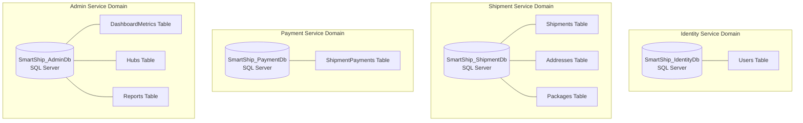
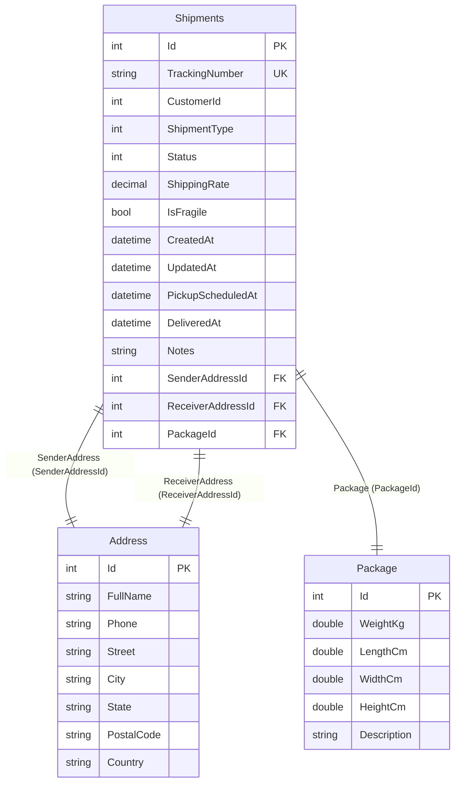

# SmartShip – Database Design & Schema Documentation

Comprehensive relational database documentation for SmartShip microservices, enforcing the **Database-per-Service** architectural pattern across Microsoft SQL Server instances using Entity Framework Core 10.0.

---

## Database Architecture Overview

---

## 1. Database: `SmartShip_IdentityDb`
* **Owning Microservice**: `IdentityService` (`Port 5002`)
* **ORM Engine**: Entity Framework Core 10.0 Code-First
* **Migrations**: `20260808124730_InitialCreate`, `20260811154159_table-update`

### Table: `Users`

| Column Name | Data Type | Nullable | Key / Index | Description |
| :--- | :--- | :--- | :--- | :--- |
| `Id` | `int` | No | Primary Key (`IDENTITY`) | Auto-incrementing User ID |
| `Name` | `nvarchar(max)` | No | None | Full name of the user |
| `Email` | `nvarchar(450)` | No | Unique Index | User email address (login credential) |
| `Phone` | `nvarchar(max)` | No | None | Contact telephone number |
| `PasswordHash` | `nvarchar(max)` | No | None | Cryptographic BCrypt password hash |
| `Role` | `nvarchar(max)` | No | Default: `"CUSTOMER"` | System role (`"CUSTOMER"`, `"ADMIN"`) |
| `IsActive` | `bit` | No | Default: `1` (`true`) | Account active flag |
| `CreatedAt` | `datetime2` | No | Default: `GETDATE()` | Registration timestamp |

---

## 2. Database: `SmartShip_ShipmentDb`
* **Owning Microservice**: `ShipmentService` (`Port 5004`)
* **ORM Engine**: Entity Framework Core 10.0 Code-First
* **Migrations**: `20260816140407_tableupdate`

### ER Diagram: `ShipmentDb`

### Table: `Shipments`

| Column Name | Data Type | Nullable | Key / Index | Description |
| :--- | :--- | :--- | :--- | :--- |
| `Id` | `int` | No | Primary Key (`IDENTITY`) | Unique shipment identifier |
| `TrackingNumber` | `nvarchar(450)` | No | Unique Index | Public tracking code (`SHP-YYYYMMDDHHMMSS-XXXX`) |
| `CustomerId` | `int` | No | Index | Logical reference to `IdentityDb.Users.Id` |
| `ShipmentType` | `int` | No | Enum | `0=Domestic, 1=Express, 2=Freight, 3=International` |
| `Status` | `int` | No | Enum | `0=Draft, 1=Booked, 2=PickedUp, 3=InTransit...` |
| `ShippingRate` | `decimal(18,2)` | No | None | Base shipping cost |
| `IsFragile` | `bit` | No | Default: `0` | Special handling flag |
| `CreatedAt` | `datetime2` | No | Default: `GETDATE()` | Creation timestamp |
| `UpdatedAt` | `datetime2` | Yes | None | Last status update timestamp |
| `PickupScheduledAt`| `datetime2` | Yes | None | Scheduled pickup timestamp |
| `DeliveredAt` | `datetime2` | Yes | None | Final delivery timestamp |
| `Notes` | `nvarchar(max)` | Yes | None | Parcel instructions / cancellation reason |
| `SenderAddressId` | `int` | No | Foreign Key -> `Addresses.Id` | Origin sender address link |
| `ReceiverAddressId`| `int` | No | Foreign Key -> `Addresses.Id` | Destination receiver address link |
| `PackageId` | `int` | No | Foreign Key -> `Packages.Id` | Parcel physical dimensions link |

### Table: `Addresses`

| Column Name | Data Type | Nullable | Key / Index | Description |
| :--- | :--- | :--- | :--- | :--- |
| `Id` | `int` | No | Primary Key (`IDENTITY`) | Address identifier |
| `FullName` | `nvarchar(max)` | No | None | Contact person name |
| `Phone` | `nvarchar(max)` | No | None | Contact phone number |
| `Street` | `nvarchar(max)` | No | None | Street address |
| `City` | `nvarchar(max)` | No | None | City name |
| `State` | `nvarchar(max)` | No | None | State / Province |
| `PostalCode` | `nvarchar(max)` | No | None | Postal / ZIP code |
| `Country` | `nvarchar(max)` | No | None | Country name |

### Table: `Packages`

| Column Name | Data Type | Nullable | Key / Index | Description |
| :--- | :--- | :--- | :--- | :--- |
| `Id` | `int` | No | Primary Key (`IDENTITY`) | Package identifier |
| `WeightKg` | `float` | No | None | Weight in kilograms |
| `LengthCm` | `float` | No | None | Package length in centimeters |
| `WidthCm` | `float` | No | None | Package width in centimeters |
| `HeightCm` | `float` | No | None | Package height in centimeters |
| `Description` | `nvarchar(max)` | No | None | Package contents description |

---

## 3. Database: `SmartShip_PaymentDb`
* **Owning Microservice**: `PaymentService` (`Port 5003`)
* **ORM Engine**: Entity Framework Core 10.0 Code-First
* **Migrations**: `20260810175151_InitialCreate`

### Table: `ShipmentPayments`

| Column Name | Data Type | Nullable | Key / Index | Description |
| :--- | :--- | :--- | :--- | :--- |
| `Id` | `int` | No | Primary Key (`IDENTITY`) | Payment transaction ID |
| `ShipmentId` | `int` | No | Index | Logical reference to `ShipmentDb.Shipments.Id` |
| `TrackingNumber` | `nvarchar(max)` | No | None | Tracking code copy for payment search |
| `CustomerId` | `int` | No | Index | Logical reference to `IdentityDb.Users.Id` |
| `Amount` | `decimal(18,2)` | No | None | Total payable amount (Base + Surcharges + GST) |
| `PaymentMethod` | `int` | No | Enum | `0=Online, 1=COD` |
| `PaymentStatus` | `int` | No | Enum | `0=Pending, 1=Paid, 2=Failed, 3=Refunded` |
| `RazorpayOrderId` | `nvarchar(max)` | Yes | None | Razorpay Order ID (`order_...`) |
| `RazorpayPaymentId`| `nvarchar(max)` | Yes | None | Razorpay Payment ID (`pay_...`) |
| `RazorpaySignature`| `nvarchar(max)` | Yes | None | HMAC-SHA256 verification signature |
| `CreatedAt` | `datetime2` | No | Default: `GETDATE()` | Payment initiation timestamp |
| `PaidAt` | `datetime2` | Yes | None | Payment completion timestamp |

---

## 4. Database: `SmartShip_AdminDb`
* **Owning Microservice**: `AdminService` (`Port 5001`)
* **ORM Engine**: Entity Framework Core 10.0 Code-First
* **Migrations**: `20260806175544_InitialCreate`

### Table: `DashboardMetrics`

| Column Name | Data Type | Nullable | Key / Index | Description |
| :--- | :--- | :--- | :--- | :--- |
| `Id` | `int` | No | Primary Key (`IDENTITY`) | Metrics record ID (Singleton) |
| `TotalShipments` | `int` | No | None | Total cumulative shipments count |
| `ActiveShipments` | `int` | No | None | Currently active in-transit shipments count |
| `DeliveredShipments`| `int` | No | None | Total completed deliveries count |
| `TotalRevenue` | `decimal(18,2)` | No | None | Aggregated system revenue |
| `RegisteredCustomers`| `int` | No | None | Active registered customer users count |
| `LastUpdated` | `datetime2` | No | None | Timestamp of last event update |

### Table: `Hubs`

| Column Name | Data Type | Nullable | Key / Index | Description |
| :--- | :--- | :--- | :--- | :--- |
| `Id` | `int` | No | Primary Key (`IDENTITY`) | Hub ID |
| `HubCode` | `nvarchar(450)` | No | Unique Index | Logistics code (e.g. `"HUB-BLR-01"`) |
| `Name` | `nvarchar(max)` | No | None | Hub name |
| `City` | `nvarchar(max)` | No | None | Hub city |
| `State` | `nvarchar(max)` | No | None | Hub state |
| `Address` | `nvarchar(max)` | No | None | Physical address |
| `Pincode` | `nvarchar(max)` | No | None | Postal PIN code |
| `ContactPhone` | `nvarchar(max)` | No | None | Operations telephone number |
| `IsActive` | `bit` | No | Default: `1` | Operational state flag |

### Table: `Reports`

| Column Name | Data Type | Nullable | Key / Index | Description |
| :--- | :--- | :--- | :--- | :--- |
| `Id` | `int` | No | Primary Key (`IDENTITY`) | Report ID |
| `ReportType` | `int` | No | Enum | `0=Revenue, 1=Shipments, 2=Users, 3=HubPerformance` |
| `GeneratedBy` | `nvarchar(max)` | No | None | Admin user name |
| `GeneratedAt` | `datetime2` | No | Default: `GETDATE()` | Generation timestamp |
| `SummaryJson` | `nvarchar(max)` | No | None | JSON summary payload |
| `FilePath` | `nvarchar(max)` | No | None | Generated report file location |

---

## Enumeration Mappings Reference

### `ShipmentType` (Shipment Service)
- `0`: `Domestic` (Base Rate multiplier: ₹80 / kg)
- `1`: `Express` (Base Rate multiplier: ₹150 / kg)
- `2`: `Freight` (Base Rate multiplier: ₹50 / kg)
- `3`: `International` (Base Rate multiplier: ₹300 / kg)

### `ShipmentStatus` (Shipment Service)
- `0`: `Draft`
- `1`: `Booked`
- `2`: `PickedUp`
- `3`: `InTransit`
- `4`: `OutForDelivery`
- `5`: `Delivered`
- `6`: `Delayed`
- `7`: `Failed`
- `8`: `Returned`
- `9`: `Cancelled`
- `10`: `PaymentFailed`

### `PaymentMethod` (Payment Service)
- `0`: `Online`
- `1`: `COD`

### `PaymentStatus` (Payment Service)
- `0`: `Pending`
- `1`: `Paid`
- `2`: `Failed`
- `3`: `Refunded`

### `ReportType` (Admin Service)
- `0`: `Revenue`
- `1`: `Shipments`
- `2`: `Users`
- `3`: `HubPerformance`

---

## Database-per-Service Architectural Rationale

1. **Independent Schema Evolution**: `ShipmentService` can alter package dimension columns or add transit tables without risking breaking changes to `PaymentDb` or `IdentityDb`.
2. **Targeted Performance Scaling**: `ShipmentDb` can be provisioned with high read/write IOPS during peak booking hours independently of `AdminDb`.
3. **Strict Domain Boundary Isolation**: Eliminates illicit cross-domain SQL joins in application code, ensuring services communicate purely via formal API contracts or MassTransit events.

---

*Database documentation compiled for **SmartShip Logistics System**.*
