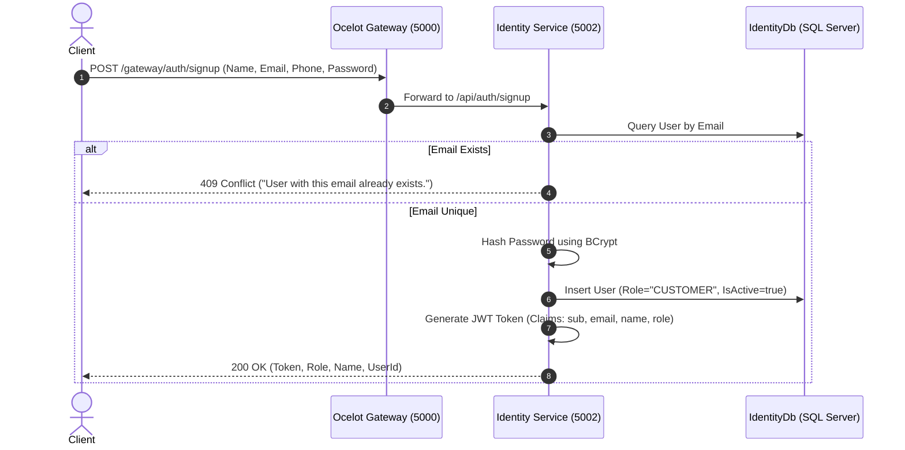
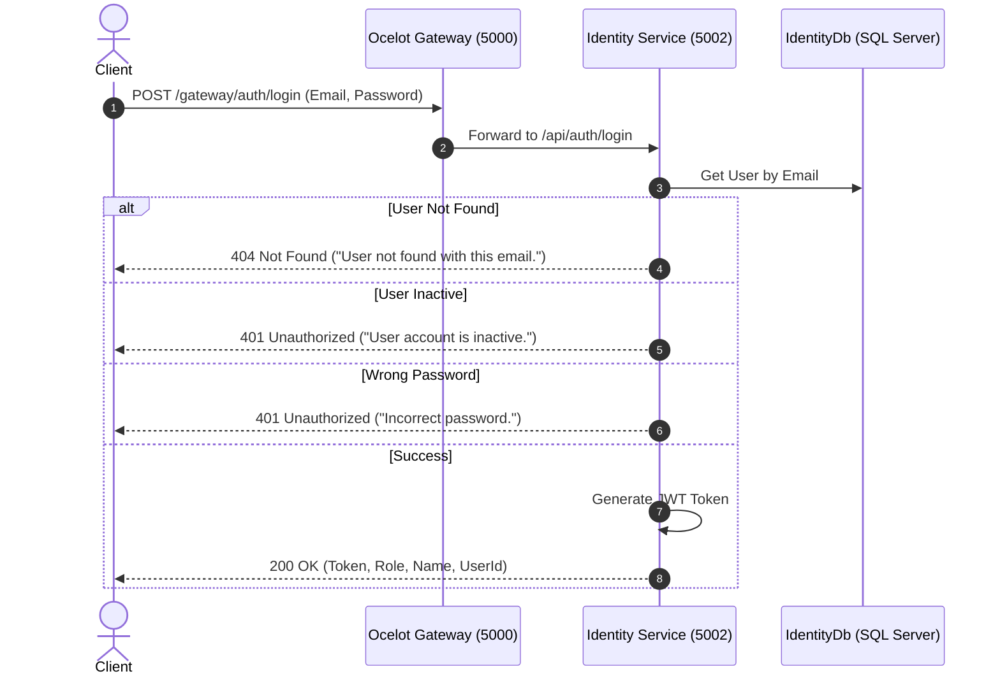
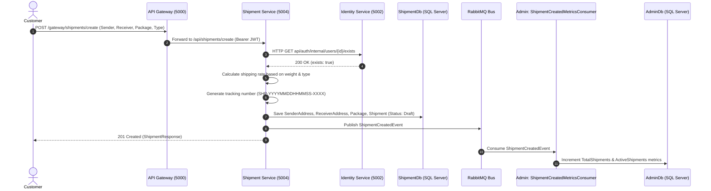
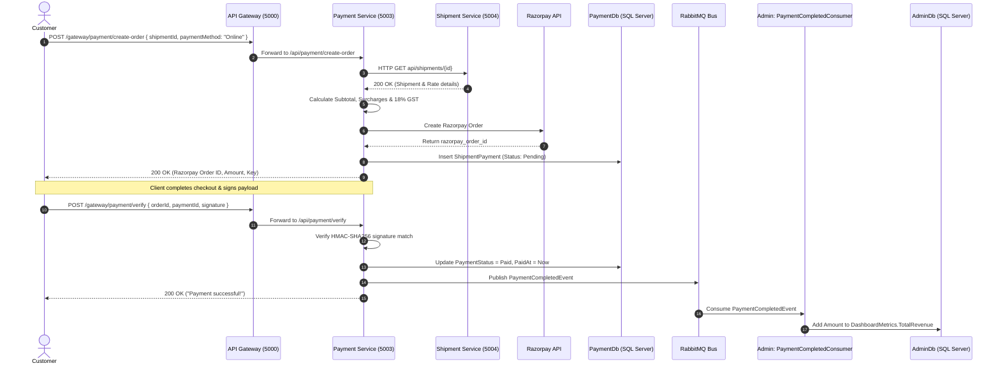
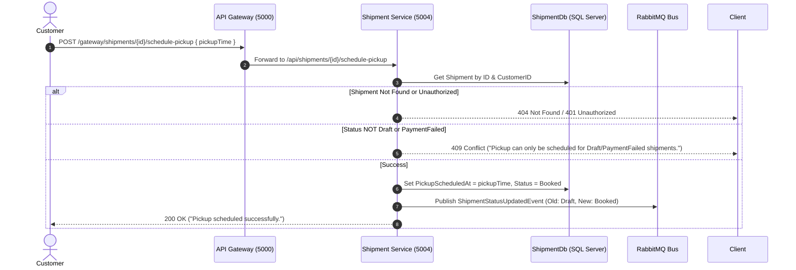
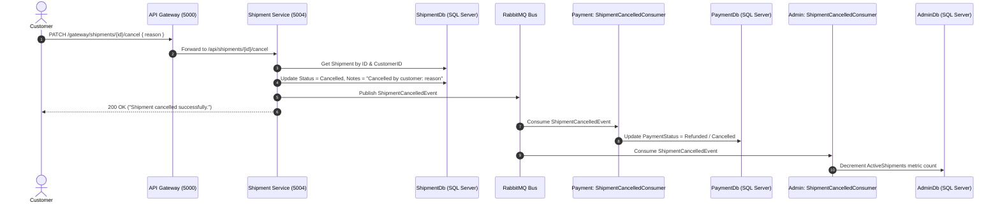
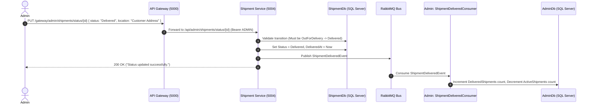
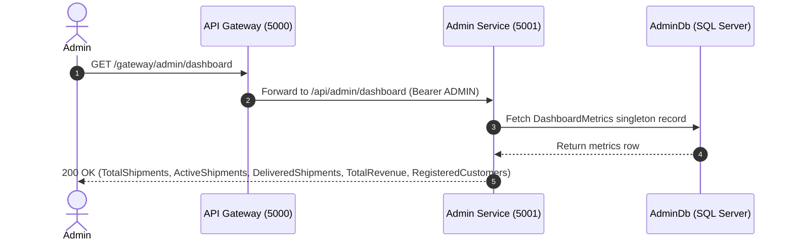
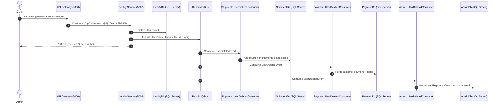
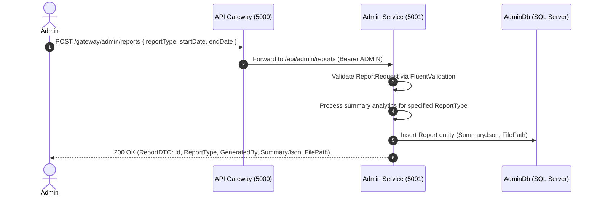

# SmartShip – End-to-End Execution Flows

Detailed step-by-step execution diagrams and architectural traces for all major workflows in the SmartShip logistics platform.

---

## 1. User Signup Flow

### Execution Steps
1. **Client**: Issues `POST /gateway/auth/signup` with payload (`Name`, `Email`, `Phone`, `Password`).
2. **Gateway**: Passes request through to `IdentityService` on port `5002`.
3. **Service**: `AuthService.SignupAsync` validates email uniqueness against `IUserRepository`.
4. **Database**: `IdentityDb` queries `Users` table by email.
5. **Security**: Hashes password using `BCrypt.Net.BCrypt.HashPassword(request.Password)`.
6. **Persistence**: Saves new `User` entity to `IdentityDb` via `UnitOfWork.SaveChangesAsync()`.
7. **Token**: Generates signed JWT token with `userId`, `email`, `name`, and `role` claims.
8. **Final Result**: Returns `AuthResponse` containing JWT token and customer user details.

---

## 2. User Login Flow

### Execution Steps
1. **Client**: Issues `POST /gateway/auth/login` (`Email`, `Password`).
2. **Gateway**: Forwards request to `IdentityService` (`/api/auth/login`).
3. **Service**: `AuthService.LoginAsync` fetches user record by email.
4. **Database**: Queries `IdentityDb.Users`.
5. **Validation**: Verifies account is active (`IsActive == true`) and verifies password using `BCrypt.Net.BCrypt.Verify`.
6. **Token Generation**: Constructs JWT token with standard claims.
7. **Final Result**: Returns HTTP 200 OK with `AuthResponse`.

---

## 3. Create Shipment Flow

### Execution Steps
1. **Request**: Customer sends `POST /gateway/shipments/create` with address details and package dimensions.
2. **Gateway**: Validates JWT token and routes to `ShipmentService` on port `5004`.
3. **Internal Verification**: `ShipmentService` calls `IdentityService` (`api/auth/internal/users/{id}/exists`) to verify active user status.
4. **Rate Engine**: `CalculateRateAsync` calculates shipping price based on package weight and `ShipmentType`.
5. **Tracking Generator**: Generates unique tracking code `SHP-YYYYMMDDHHMMSS-XXXX`.
6. **Database Update**: Inserts `SenderAddress`, `ReceiverAddress`, `Package`, and `Shipment` entities into `ShipmentDb`.
7. **Event Publishing**: MassTransit publishes `ShipmentCreatedEvent` to RabbitMQ.
8. **Asynchronous Consumer**: `AdminService`'s `ShipmentCreatedMetricsConsumer` receives event and updates `DashboardMetrics` in `AdminDb`.
9. **Final Result**: Customer receives HTTP 201 Created with full shipment details and initial status `Draft`.

---

## 4. Online Payment Order & Verification Flow

### Execution Steps
1. **Order Initiation**: Customer requests Razorpay order creation via `POST /gateway/payment/create-order`.
2. **Ownership Check**: `PaymentService` calls `ShipmentService` via HTTP (`GET api/shipments/{id}`) to verify parcel ownership and retrieve base shipping rate.
3. **Itemized Tax Math**: Calculates Fuel Surcharge (5%), Handling Fee, Fragile Surcharge, and 18% GST.
4. **Razorpay Integration**: Creates order via `RazorpayClientWrapper`, securing a `razorpay_order_id`.
5. **Pending Record**: Saves `ShipmentPayment` record with status `Pending` in `PaymentDb`.
6. **Signature Verification**: Customer submits Razorpay response to `POST /gateway/payment/verify`. `PaymentService` verifies HMAC-SHA256 signature (`orderId + "|" + paymentId`).
7. **Database Save**: Updates `PaymentStatus = Paid` and records `PaidAt` timestamp.
8. **Event Trigger**: Publishes `PaymentCompletedEvent` to MassTransit bus.
9. **Metrics Aggregation**: `AdminService` consumes event and updates `TotalRevenue` in `AdminDb`.
10. **Final Result**: Payment is verified and recorded cleanly.

---

## 5. Schedule Pickup Flow

### Execution Steps
1. **Request**: Customer issues `POST /gateway/shipments/{id}/schedule-pickup` with desired pickup time.
2. **Gateway**: Validates JWT token and forwards to `ShipmentService`.
3. **Ownership & State Check**: Verifies shipment exists, belongs to the calling customer, and is currently in `Draft` or `PaymentFailed` state.
4. **State Transition**: Sets `PickupScheduledAt` timestamp and updates `Status` from `Draft` to `Booked`.
5. **Database Commit**: Persists status transition to `ShipmentDb`.
6. **Event Dispatch**: Publishes `ShipmentStatusUpdatedEvent` to notify logistics system.
7. **Final Result**: Shipment status advances to `Booked`.

---

## 6. Shipment Cancellation by Customer

### Execution Steps
1. **Request**: Customer issues `PATCH /gateway/shipments/{id}/cancel` with reason string.
2. **Validation**: `ShipmentService` ensures shipment is in `Draft` or `Booked` status (cannot cancel delivered or in-transit shipments).
3. **Database Update**: Sets `Status = Cancelled` and appends cancellation notes in `ShipmentDb`.
4. **Event Published**: MassTransit publishes `ShipmentCancelledEvent`.
5. **Payment Cascade**: `PaymentService`'s `ShipmentCancelledConsumer` receives event and updates payment status to `Refunded` / `Cancelled`.
6. **Admin Metrics Cascade**: `AdminService`'s `ShipmentCancelledConsumer` receives event and decrements `ActiveShipments` in `AdminDb`.
7. **Final Result**: Shipment and associated financial/analytical records are updated cleanly across microservices.

---

## 7. Admin Shipment Status Advancement & Delivery Flow

### Execution Steps
1. **Admin Action**: Admin calls `PUT /gateway/admin/shipments/status/{id}` specifying new status (`PickedUp`, `Delivered`, etc.).
2. **State Validation**: `ShipmentService` enforces state machine constraints (e.g., `Delivered` requires prior status to be `OutForDelivery`).
3. **Database Commit**: Updates `Status` and sets `DeliveredAt` timestamp in `ShipmentDb`.
4. **Event Trigger**: When status becomes `Delivered`, publishes `ShipmentDeliveredEvent`.
5. **Metrics Update**: `AdminService` consumes `ShipmentDeliveredEvent`, incrementing `DeliveredShipments` and decrementing `ActiveShipments` in `AdminDb`.
6. **Final Result**: Parcel status is updated and reflected across system metrics.

---

## 8. Admin Dashboard Metrics Aggregation Flow

### Execution Steps
1. **Request**: Admin issues `GET /gateway/admin/dashboard`.
2. **Gateway**: Validates `ADMIN` role claim in JWT token and forwards to `AdminService` port `5001`.
3. **Repository Query**: `AdminService` queries `DashboardMetricsRepository` for aggregated metrics.
4. **Database Read**: Reads pre-aggregated values stored in `AdminDb.DashboardMetrics`.
5. **Final Result**: Returns `DashboardMetricsDTO` instantly without calculating expensive runtime joins across microservice databases.

---

## 9. Customer Account Deletion & Event Cascade Flow

### Execution Steps
1. **Request**: Admin issues `DELETE /gateway/admin/users/{id}`.
2. **Identity Processing**: `UserService.DeleteUserAsync` ensures user is not an `ADMIN`, deletes `User` row from `IdentityDb`, and commits transaction.
3. **Event Dispatch**: Publishes `UserDeletedEvent` containing `UserId` and `Email` via MassTransit.
4. **Shipment Cleanup**: `ShipmentService.UserDeletedConsumer` receives event and purges user shipments from `ShipmentDb`.
5. **Payment Cleanup**: `PaymentService.UserDeletedConsumer` receives event and purges payment records from `PaymentDb`.
6. **Admin Metrics**: `AdminService.UserDeletedConsumer` decrements `RegisteredCustomers` count in `AdminDb`.
7. **Final Result**: User and associated cross-service data are cleaned up asynchronously.

---

## 10. Report Generation Flow

### Execution Steps
1. **Request**: Admin submits `POST /gateway/admin/reports` (`ReportType`, date range).
2. **Validation**: `ReportValidator` verifies valid `ReportType` enum value.
3. **Generation Engine**: `AdminService.GenerateReportAsync` calculates business performance figures for requested domain (`Revenue`, `Shipments`, `Users`, or `HubPerformance`).
4. **Persistence**: Saves `Report` record containing summary JSON payload and generated file path in `AdminDb`.
5. **Final Result**: Returns `ReportDTO` containing report ID, timestamp, generated path, and structured summary.

---

*End-to-End Execution Flows Reference for **SmartShip Logistics System**.*
