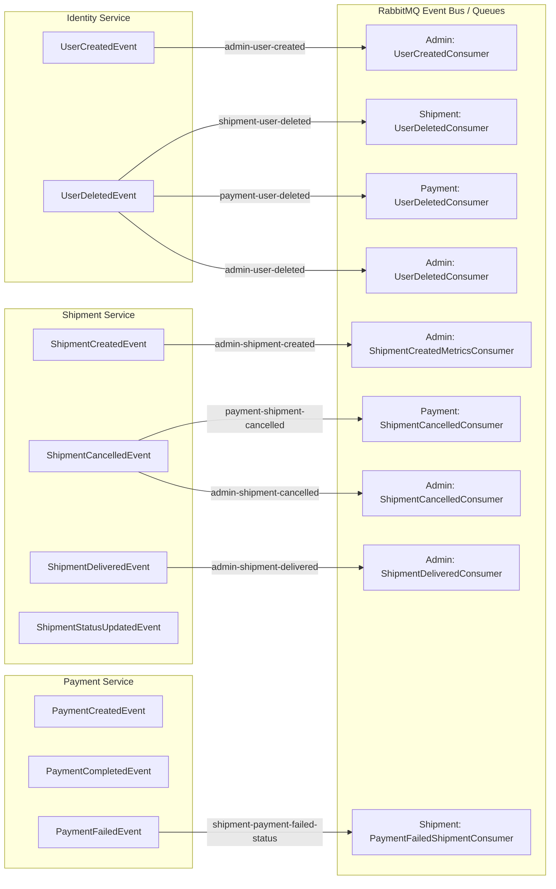

# SmartShip – Event Catalog & Messaging Architecture

Complete event-driven specification detailing all MassTransit event contracts, commands, publishers, consumers, RabbitMQ queues, payloads, and side effects across the SmartShip platform.

---

## Overall Event Flow Diagram



---

## 1. Event: `UserCreatedEvent`
* **Publisher**: `IdentityService`
* **Consumers**: `AdminService` (`UserCreatedConsumer`)
* **RabbitMQ Queue**: `admin-user-created`
* **Purpose**: Notifies administrative services when a new customer registers.
* **Trigger**: Executed upon user registration in `IdentityService`.
* **Payload Class**:
```csharp
public class UserCreatedEvent
{
    public int UserId { get; set; }
    public string Email { get; set; } = string.Empty;
    public string Name { get; set; } = string.Empty;
    public string Role { get; set; } = string.Empty;
    public DateTime CreatedAt { get; set; }
}
```
* **Payload JSON Example**:
```json
{
  "userId": 15,
  "email": "jane@example.com",
  "name": "Jane Doe",
  "role": "CUSTOMER",
  "createdAt": "2026-08-16T21:00:00Z"
}
```
* **Business Side Effect**: `AdminService` increments `RegisteredCustomers` count in `AdminDb.DashboardMetrics`.

---

## 2. Event: `UserDeletedEvent`
* **Publisher**: `IdentityService` (`UserService.cs`)
* **Consumers**: 
  1. `ShipmentService` (`UserDeletedConsumer` -> Queue: `shipment-user-deleted`)
  2. `PaymentService` (`UserDeletedConsumer` -> Queue: `payment-user-deleted`)
  3. `AdminService` (`UserDeletedConsumer` -> Queue: `admin-user-deleted`)
* **Purpose**: Triggers cascading cleanup of user records across microservice databases.
* **Trigger**: Admin deletes a user via `DELETE /gateway/admin/users/{id}`.
* **Payload Class**:
```csharp
public class UserDeletedEvent
{
    public int UserId { get; set; }
    public string Email { get; set; } = string.Empty;
    public DateTime DeletedAt { get; set; }
    public string Role { get; set; } = string.Empty;
}
```
* **Business Side Effect**:
  * `ShipmentService` purges shipments associated with `UserId`.
  * `PaymentService` purges payment transactions for `UserId`.
  * `AdminService` decrements `RegisteredCustomers` count metric.

---

## 3. Event: `ShipmentCreatedEvent`
* **Publisher**: `ShipmentService` (`ShipmentService.cs`)
* **Consumers**: `AdminService` (`ShipmentCreatedMetricsConsumer`)
* **RabbitMQ Queue**: `admin-shipment-created`
* **Purpose**: Notifies admin service of new parcel bookings.
* **Trigger**: Successful execution of `POST /gateway/shipments/create`.
* **Payload Class**:
```csharp
public class ShipmentCreatedEvent
{
    public int ShipmentId { get; set; }
    public string TrackingNumber { get; set; } = string.Empty;
    public int CustomerId { get; set; }
    public string SenderCity { get; set; } = string.Empty;
    public DateTime CreatedAt { get; set; }
    public decimal Amount { get; set; }
    public bool IsFragile { get; set; }
}
```
* **Business Side Effect**: `AdminService` increments `TotalShipments` and `ActiveShipments` counts in `DashboardMetrics`.

---

## 4. Event: `ShipmentCancelledEvent`
* **Publisher**: `ShipmentService` (`ShipmentService.cs` & `CancelShipmentConsumer.cs`)
* **Consumers**:
  1. `PaymentService` (`ShipmentCancelledConsumer` -> Queue: `payment-shipment-cancelled`)
  2. `AdminService` (`ShipmentCancelledConsumer` -> Queue: `admin-shipment-cancelled`)
* **Purpose**: Broadcasts parcel cancellation to payment and analytics services.
* **Trigger**: Customer cancels shipment via API or payment failure auto-cancels draft.
* **Payload Class**:
```csharp
public class ShipmentCancelledEvent
{
    public int ShipmentId { get; set; }
    public string TrackingNumber { get; set; } = "";
    public DateTime CancelledAt { get; set; } = DateTime.Now;
    public int CustomerId { get; set; }
}
```
* **Business Side Effect**: `PaymentService` sets payment status to `Refunded`/`Cancelled`. `AdminService` decrements `ActiveShipments` count.

---

## 5. Event: `ShipmentCancelledByCustomerEvent`
* **Publisher**: `ShipmentService` (`ShipmentService.cs`)
* **Consumers**: `PaymentService` (`ShipmentCancelledByCustomerConsumer`)
* **RabbitMQ Queue**: `payment-shipment-cancelled-by-customer`
* **Purpose**: Specific customer-initiated cancellation notification.
* **Payload Class**:
```csharp
public class ShipmentCancelledByCustomerEvent
{
    public int ShipmentId { get; set; }
    public string TrackingNumber { get; set; } = string.Empty;
    public int CustomerId { get; set; }
    public decimal Amount { get; set; }
    public bool WasPaid { get; set; }       
    public DateTime CancelledAt { get; set; } = DateTime.Now;
    public string Reason { get; set; } = string.Empty;
}
```
* **Business Side Effect**: Triggers automated refund processing logic in `PaymentService` if `WasPaid == true`.

---

## 6. Event: `ShipmentDeliveredEvent`
* **Publisher**: `ShipmentService` (`ShipmentService.cs`)
* **Consumers**: `AdminService` (`ShipmentDeliveredConsumer`)
* **RabbitMQ Queue**: `admin-shipment-delivered`
* **Purpose**: Signals successful parcel delivery to end recipient.
* **Trigger**: Admin sets shipment status to `Delivered`.
* **Payload Class**:
```csharp
public class ShipmentDeliveredEvent
{
    public int ShipmentId { get; set; }
    public string TrackingNumber { get; set; } = string.Empty;
    public int CustomerId { get; set; }
    public DateTime DeliveredAt { get; set; }
    public string? Location { get; set; }
}
```
* **Business Side Effect**: `AdminService` increments `DeliveredShipments` and decrements `ActiveShipments` count.

---

## 7. Event: `ShipmentStatusUpdatedEvent`
* **Publisher**: `ShipmentService` (`ShipmentService.cs`)
* **Consumers**: External logistics tracking sub-systems
* **Purpose**: Broadcasts intermediate transit status updates (`Booked`, `PickedUp`, `InTransit`, `OutForDelivery`).
* **Payload Class**:
```csharp
public class ShipmentStatusUpdatedEvent
{
    public int ShipmentId { get; set; }
    public string TrackingNumber { get; set; } = string.Empty;
    public string OldStatus { get; set; } = string.Empty;
    public string NewStatus { get; set; } = string.Empty;
    public string Location { get; set; } = string.Empty;
    public string UpdatedBy { get; set; } = string.Empty;
    public DateTime UpdatedAt { get; set; }
    public int CustomerId { get; set; }
}
```

---

## 8. Event: `PaymentCreatedEvent`
* **Publisher**: `PaymentService` (`PaymentService.cs`)
* **Consumers**: Internal payment listeners / Audit services
* **Purpose**: Notifies system of newly generated payment order.
* **Payload Class**:
```csharp
public class PaymentCreatedEvent
{
    public int ShipmentId { get; set; }
    public string TrackingNumber { get; set; } = string.Empty;
    public int CustomerId { get; set; }
    public string PaymentMethod { get; set; } = string.Empty;
    public decimal Amount { get; set; }
    public DateTime CreatedAt { get; set; } = DateTime.Now;
}
```

---

## 9. Event: `PaymentCompletedEvent`
* **Publisher**: `PaymentService` (`PaymentService.cs`)
* **Consumers**: `AdminService` (`PaymentCompletedConsumer`)
* **Purpose**: Broadcasts successful online Razorpay or COD payment verification.
* **Trigger**: Successful signature verification in `POST /gateway/payment/verify`.
* **Payload Class**:
```csharp
public class PaymentCompletedEvent
{
    public int ShipmentId { get; set; }
    public string TrackingNumber { get; set; } = "";
    public string PaymentMethod { get; set; } = "";
    public string PaymentStatus { get; set; } = "";
    public int CustomerId { get; set; }
    public decimal Amount { get; set; }
    public string? PaidAt { get; set; }
    public string? RazorpayPaymentId { get; set; }
    public string? RazorpayOrderId { get; set; }
}
```
* **Business Side Effect**: `AdminService` adds `Amount` to `DashboardMetrics.TotalRevenue`.

---

## 10. Event: `PaymentFailedEvent`
* **Publisher**: `PaymentService` (`PaymentService.cs`)
* **Consumers**: `ShipmentService` (`PaymentFailedShipmentConsumer`)
* **RabbitMQ Queue**: `shipment-payment-failed-status`
* **Purpose**: Signals payment verification failure due to signature mismatch or transaction decline.
* **Payload Class**:
```csharp
public class PaymentFailedEvent
{
    public int ShipmentId { get; set; }
    public string TrackingNumber { get; set; } = string.Empty;
    public int CustomerId { get; set; }
    public string Reason { get; set; } = string.Empty;
    public DateTime FailedAt { get; set; }
}
```
* **Business Side Effect**: `ShipmentService` updates shipment status to `PaymentFailed` and logs failure reason.

---

## 11. Command: `CancelShipmentCommand`
* **Publisher**: System / Payment Failure Handler
* **Consumers**: `ShipmentService` (`CancelShipmentConsumer`)
* **RabbitMQ Queue**: `shipment-cancel-command`
* **Purpose**: Command instructing `ShipmentService` to auto-cancel a shipment.
* **Payload Class**:
```csharp
public class CancelShipmentCommand
{
    public int ShipmentId { get; set; }
    public string TrackingNumber { get; set; } = string.Empty;
    public int CustomerId { get; set; }
    public string Reason { get; set; } = string.Empty;
}
```

---

## 12. Command: `UpdateShipmentStatusToPaymentFailedCommand`
* **Publisher**: Payment Service
* **Consumers**: `ShipmentService` (`PaymentFailedShipmentConsumer`)
* **Purpose**: Command instructing `ShipmentService` to set status = `PaymentFailed`.
* **Payload Class**:
```csharp
public class UpdateShipmentStatusToPaymentFailedCommand
{
    public int ShipmentId { get; set; }
    public string TrackingNumber { get; set; } = string.Empty;
    public string Reason { get; set; } = string.Empty;
}
```

---

## 13. Event: `PaymentRefundedEvent`
* **Publisher**: Payment Service
* **Consumers**: Audit Services
* **Purpose**: Signals completion of payment refund transaction.
* **Payload Class**:
```csharp
public class PaymentRefundedEvent
{
    public int ShipmentId { get; set; }
    public string TrackingNumber { get; set; } = string.Empty;
    public int CustomerId { get; set; }
    public decimal Amount { get; set; }
    public DateTime RefundedAt { get; set; } = DateTime.Now;
}
```

---

*Event Catalog compiled for **SmartShip Logistics System**.*
