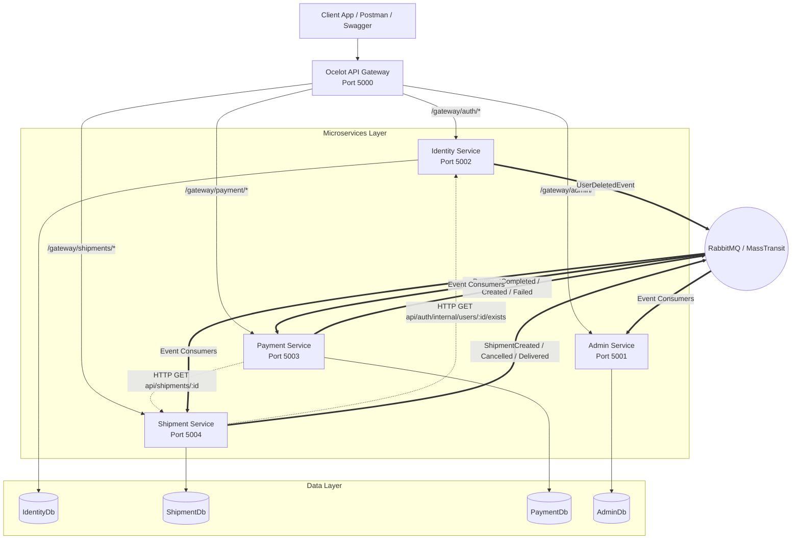

# SmartShip – Comprehensive Technical Documentation

---

## 1. Executive Summary
**SmartShip** is a distributed, event-driven microservices logistics platform built on **C# 13**, **.NET 10.0**, **Entity Framework Core 10.0**, **Microsoft SQL Server**, **Ocelot API Gateway**, and **RabbitMQ via MassTransit**. The system decouples logistics operations into four autonomous microservices (`IdentityService`, `ShipmentService`, `PaymentService`, and `AdminService`), fronted by a reverse-proxy API Gateway (`SmartShip.Gateway`) on port `5000`. SmartShip provides automated shipment rate calculations, parcel booking, pickup scheduling, multi-option payment processing (Razorpay online signature verification and Cash on Delivery), parcel tracking, logistics hub administration, and real-time event-driven dashboard metrics aggregation.

---

## 2. Business Requirements
- **Automated Rate Quoting**: Calculate dynamic shipping rates based on parcel weight (kg) and shipping tier (`Domestic`, `Express`, `Freight`, `International`).
- **Seamless Booking & Pickup**: Enable customers to create draft shipments and schedule courier pickups.
- **Flexible Payment Integration**: Support online digital payments via Razorpay and Cash-on-Delivery (COD) with itemized surcharge calculations (Fuel Surcharge, Handling Fee, Fragile Surcharge, COD Fee, 18% GST).
- **Public & Authenticated Parcel Tracking**: Provide real-time tracking by tracking number (`SHP-YYYYMMDDHHMMSS-XXXX`).
- **Hub & Logistics Network Control**: Empower administrators to create, update, and monitor regional logistics hubs.
- **Real-Time Operations Analytics**: Aggregate platform-wide metrics (revenue, active shipments, delivered orders, registered customers) without cross-database queries.

---

## 3. Functional Requirements
- **User Identity Management**: User registration, login credential verification, JWT issuance, profile updates, account activation/deactivation, account deletion.
- **Shipment Management**: Create shipment draft, schedule pickup timestamp, auto-generate tracking numbers, query shipment details, advance shipment status (`Draft` -> `Booked` -> `PickedUp` -> `InTransit` -> `OutForDelivery` -> `Delivered`), cancel draft/booked shipments.
- **Payment Operations**: Create Razorpay payment orders, verify HMAC-SHA256 signatures, register COD requests, generate demo payment credentials for testing, query payment history by customer or shipment ID.
- **Logistics Administration**: Provision regional logistics hubs, toggle active hub status, generate business reports (Revenue, Shipments, Users, Hub Performance), view real-time metrics dashboard.

---

## 4. Non-Functional Requirements
- **Fault Isolation**: Domain service failures (e.g., Payment Service downtime) must not block unrelated workflows (e.g., User registration).
- **Security & Integrity**: Passwords hashed using BCrypt. Direct API endpoints protected via JWT Bearer authentication and role-based checks (`CUSTOMER` vs `ADMIN`). Payment integrity secured via HMAC-SHA256 signature verification.
- **Scalability**: Stateless microservices capable of independent horizontal scaling.
- **Auditability & Observability**: Enriched structured logging using Serilog across Console and file sinks (`./Logs/log-YYYYMMDD.log`).
- **Data Autonomy**: Database-per-Service pattern enforcing strict domain isolation.

---

## 5. System Architecture & Service Boundaries



---

## 6. Service Boundaries Definition

| Service Name | Port | Primary Responsibility | Data Store | Key Dependencies |
| :--- | :--- | :--- | :--- | :--- |
| **SmartShip.Gateway** | 5000 | Reverse proxy routing, JWT validation pass-through, Swagger UI aggregation | None | Ocelot, SwaggerForOcelot |
| **IdentityService** | 5002 | Authentication, user accounts, BCrypt password hashing, JWT token issuance | `IdentityDb` (SQL Server) | BCrypt.Net, MassTransit |
| **ShipmentService** | 5004 | Parcel booking, rate calculations, pickup scheduling, tracking, state machine | `ShipmentDb` (SQL Server) | MassTransit, HttpClient |
| **PaymentService** | 5003 | Razorpay orders, HMAC signature validation, itemized tax math, COD orders | `PaymentDb` (SQL Server) | Razorpay SDK, MassTransit, HttpClient |
| **AdminService** | 5001 | Logistics hubs management, report generation, event-driven metrics aggregation | `AdminDb` (SQL Server) | MassTransit, FluentValidation |

---

## 7. Component Architecture within Microservices

SmartShip applies **Clean Architecture** consistently across all four microservices:

```
[ Microservice Directory Structure ]
├── Core/
│   ├── Domain/            # Pure entities, value objects, enums (Zero dependencies)
│   └── Application/       # Use case services, DTO records, FluentValidation validators, Interfaces
├── Infrastructure/        # EF Core DbContext, Repositories, Unit of Work, MassTransit Consumers
└── Presentation/          # ASP.NET Core API Controllers, Program.cs, Middleware configuration
```

---

## 8. Request / Response Lifecycle

1. **Client Request**: Client sends HTTP request to Gateway (`http://localhost:5000/gateway/...`).
2. **Gateway Processing**: Ocelot matches upstream route, validates JWT Bearer token against configured `JwtSettings`, rewrites path to downstream endpoint (`http://localhost:500x/api/...`).
3. **Controller Execution**: Downstream API Controller receives DTO. FluentValidation middleware executes model validation.
4. **Application Service**: Controller delegates to Application Service interface (e.g., `IShipmentService`).
5. **Data Access**: Application Service interacts with Repository (`IShipmentRepository`) and commits via `IUnitOfWork`.
6. **Event Dispatching**: Upon successful database save, Service publishes domain events via MassTransit (`IPublishEndpoint`).
7. **Response Serialization**: Result mapped to DTO and returned as HTTP 200/201 JSON payload.

---

## 9. Authentication Architecture

SmartShip relies on **JSON Web Tokens (JWT)** signed via HMAC-SHA256 (`SymmetricSecurityKey`).

### Token Validation Parameters Configuration (`Program.cs`)
```csharp
builder.Services.AddAuthentication(JwtBearerDefaults.AuthenticationScheme)
    .AddJwtBearer(opt => opt.TokenValidationParameters = new TokenValidationParameters
    {
        ValidateIssuer = true,
        ValidateAudience = true,
        ValidateLifetime = true,
        ValidateIssuerSigningKey = true,
        ValidIssuer = builder.Configuration["JwtSettings:Issuer"],
        ValidAudience = builder.Configuration["JwtSettings:Audience"],
        IssuerSigningKey = new SymmetricSecurityKey(Encoding.UTF8.GetBytes(builder.Configuration["JwtSettings:Key"]!))
    });
```

### Password Hashing Security
User passwords are never stored in plaintext. `AuthService.cs` utilizes BCrypt:
```csharp
var passwordHash = BCrypt.Net.BCrypt.HashPassword(request.Password);
bool isValid = BCrypt.Net.BCrypt.Verify(request.Password, user.PasswordHash);
```

---

## 10. Authorization Architecture

Authorization is enforced via standard ASP.NET Core Role-based authorization policies:
- **`[Authorize(Roles = "CUSTOMER")]`**: Protects customer actions (shipment creation, scheduling pickup, creating payment orders).
- **`[Authorize(Roles = "ADMIN")]`**: Protects administrative endpoints (user status updates, hub CRUD, status advancement, dashboard metrics).
- **`[Authorize]`**: Allows any authenticated user (Customer or Admin) to view shipment details or payment history.

---

## 11. Database Architecture & Database-per-Service

Each microservice manages its own isolated SQL Server database using EF Core Code-First migrations.

### Database Connection Configuration

| Microservice | Database Name | Connection String Key |
| :--- | :--- | :--- |
| Identity Service | `SmartShip_IdentityDb` | `DefaultConnection` |
| Shipment Service | `SmartShip_ShipmentDb` | `DefaultConnection` |
| Payment Service | `SmartShip_PaymentDb` | `DefaultConnection` |
| Admin Service | `SmartShip_AdminDb` | `DefaultConnection` |

---

## 12. Entity Relationships & Schemas

### `IdentityDb`
* **`User`**: `Id` (PK), `Name`, `Email` (UQ), `Phone`, `PasswordHash`, `Role`, `IsActive`, `CreatedAt`.

### `ShipmentDb`
* **`Shipments`**: `Id` (PK), `TrackingNumber` (UQ), `CustomerId`, `ShipmentType`, `Status`, `ShippingRate`, `IsFragile`, `CreatedAt`, `UpdatedAt`, `PickupScheduledAt`, `DeliveredAt`, `Notes`, `SenderAddressId` (FK), `ReceiverAddressId` (FK), `PackageId` (FK).
* **`Address`**: `Id` (PK), `FullName`, `Phone`, `Street`, `City`, `State`, `PostalCode`, `Country`.
* **`Package`**: `Id` (PK), `WeightKg`, `LengthCm`, `WidthCm`, `HeightCm`, `Description`.

### `PaymentDb`
* **`ShipmentPayment`**: `Id` (PK), `ShipmentId`, `TrackingNumber`, `CustomerId`, `Amount`, `PaymentMethod`, `PaymentStatus`, `RazorpayOrderId`, `RazorpayPaymentId`, `RazorpaySignature`, `CreatedAt`, `PaidAt`.

### `AdminDb`
* **`DashboardMetrics`**: `Id` (PK), `TotalShipments`, `ActiveShipments`, `DeliveredShipments`, `TotalRevenue`, `RegisteredCustomers`, `LastUpdated`.
* **`Hub`**: `Id` (PK), `HubCode` (UQ), `Name`, `City`, `State`, `Address`, `Pincode`, `ContactPhone`, `IsActive`.
* **`Report`**: `Id` (PK), `ReportType`, `GeneratedBy`, `GeneratedAt`, `SummaryJson`, `FilePath`.

---

## 13. API Architecture & Endpoint Contracts

All API controllers inherit from `ControllerBase` and return `IActionResult` wrapping DTO responses.

### Sample DTO Definitions
```csharp
public record CreateShipmentRequest(
    AddressDto SenderAddress,
    AddressDto ReceiverAddress,
    PackageDto Package,
    ShipmentType ShipmentType,
    string? Notes,
    bool IsFragile = false
);

public record ShipmentResponse(
    int Id, string TrackingNumber, int CustomerId, string ShipmentType,
    string Status, string PaymentStatus, decimal ShippingRate, string CreatedAt,
    string? PickupScheduledAt, string? DeliveredAt, AddressDto SenderAddress,
    AddressDto ReceiverAddress, PackageDto Package, string? Notes, bool IsFragile
);
```

---

## 14. API Gateway Architecture & Ocelot Configuration

`SmartShip.Gateway` uses Ocelot to map incoming requests to internal microservice ports.

```json
{
  "DownstreamPathTemplate": "/api/shipments/create",
  "DownstreamScheme": "http",
  "DownstreamHostAndPorts": [{ "Host": "localhost", "Port": 5004 }],
  "UpstreamPathTemplate": "/gateway/shipments/create",
  "UpstreamHttpMethod": [ "POST" ],
  "AuthenticationOptions": { "AuthenticationProviderKey": "Bearer" }
}
```

---

## 15. Payment Architecture & Surcharge Calculation

Payment Service performs complete tax and surcharge computations prior to Razorpay order generation:

```csharp
decimal baseRate = shipment.ShippingRate;
decimal fuelSurcharge = Math.Round(baseRate * 0.05m, 2);
decimal handlingCharge = shipment.ShipmentType == "International" ? 120m : 50m;
decimal fragileCharge = shipment.IsFragile ? 80m : 0m;
decimal codFee = request.PaymentMethod == PaymentMethod.COD ? Math.Round(baseRate * 0.015m, 2) : 0m;

decimal subtotal = baseRate + fuelSurcharge + handlingCharge + fragileCharge + codFee;
decimal gst = Math.Round(subtotal * 0.18m, 2);
decimal totalAmount = Math.Round(subtotal + gst, 2);
```

### Razorpay HMAC Signature Verification (`RazorpayClientWrapper.cs`)
```csharp
public bool VerifySignature(string orderId, string paymentId, string signature)
{
    string payload = orderId + "|" + paymentId;
    using var hmac = new HMACSHA256(Encoding.UTF8.GetBytes(_settings.KeySecret));
    byte[] hash = hmac.ComputeHash(Encoding.UTF8.GetBytes(payload));
    string generatedSignature = BitConverter.ToString(hash).Replace("-", "").ToLower();
    return generatedSignature == signature.ToLower();
}
```

---

## 16. Event-Driven Architecture Specification

MassTransit configures RabbitMQ exchanges using publish/subscribe patterns.

### Event Definitions (`SmartShip.Shared.Events`)
* `ShipmentCreatedEvent`: `ShipmentId`, `TrackingNumber`, `CustomerId`, `SenderCity`, `CreatedAt`, `Amount`, `IsFragile`.
* `PaymentCompletedEvent`: `ShipmentId`, `TrackingNumber`, `PaymentMethod`, `PaymentStatus`, `CustomerId`, `Amount`, `PaidAt`, `RazorpayPaymentId`, `RazorpayOrderId`.
* `ShipmentCancelledEvent`: `ShipmentId`, `TrackingNumber`, `CancelledAt`, `CustomerId`.
* `UserDeletedEvent`: `UserId`, `Email`, `Role`, `DeletedAt`.

---

## 17. RabbitMQ & MassTransit Configuration

In `Program.cs` of each service:
```csharp
builder.Services.AddMassTransit(x =>
{
    x.AddConsumer<ShipmentCancelledConsumer>();
    x.UsingRabbitMq((context, cfg) =>
    {
        cfg.Host(rabbitHost, "/", h =>
        {
            h.Username("guest");
            h.Password("guest");
        });
        cfg.ReceiveEndpoint("payment-shipment-cancelled", e =>
        {
            e.ConfigureConsumer<ShipmentCancelledConsumer>(context);
        });
    });
});
```

---

## 18. Shipment State Machine Logic

`ShipmentService.cs` validates status transitions to prevent invalid domain state:
- `PickedUp` requires current status to be `Booked`.
- `Booked` requires `PickupScheduledAt != null`.
- `Delivered` requires current status to be `OutForDelivery`.
- `Cancelled` can only be triggered from `Draft` or `Booked` states.

---

## 19. Parcel Tracking Architecture

Tracking is executed via `GET /gateway/shipments/by-tracking/{trackingNumber}`. The query includes EF Core eager loading:
```csharp
return await _context.Shipments
    .Include(s => s.SenderAddress)
    .Include(s => s.ReceiverAddress)
    .Include(s => s.Package)
    .FirstOrDefaultAsync(s => s.TrackingNumber == trackingNumber);
```

---

## 20. Admin Architecture & Metrics Aggregation

`AdminService` updates `DashboardMetrics` asynchronously when domain events arrive:
```csharp
public async Task Consume(ConsumeContext<ShipmentCreatedEvent> context)
{
    var metrics = await _repo.GetMetricsAsync();
    metrics.TotalShipments += 1;
    metrics.ActiveShipments += 1;
    metrics.LastUpdated = DateTime.Now;
    await _uow.SaveChangesAsync();
}
```

---

## 21. Error Handling Infrastructure

Global `ExceptionMiddleware` converts application exceptions into standard HTTP JSON payloads:
- `KeyNotFoundException` -> `404 Not Found`
- `UnauthorizedAccessException` -> `401 Unauthorized`
- `ArgumentException` -> `400 Bad Request`
- `InvalidOperationException` -> `409 Conflict`
- `TimeoutException` -> `408 Request Timeout`

---

## 22. Logging Strategy

Serilog enriches every log entry with context attributes:
```csharp
builder.Host.UseSerilog((ctx, lc) => lc
    .ReadFrom.Configuration(ctx.Configuration)
    .Enrich.FromLogContext()
    .Enrich.WithProperty("Application", "ShipmentService"));
```

---

## 23. Security Hardening Controls

- Cryptographic BCrypt password hashing.
- HMAC-SHA256 payment signature verification.
- Role-based authorization policies (`CUSTOMER` vs `ADMIN`).
- Header sanitization via Ocelot API Gateway.
- Strict DTO model validation using FluentValidation.

---

## 24. Input Validation Architecture

`FluentValidation` validators automatically validate incoming HTTP request DTOs before reaching controller actions:
```csharp
public class CreateShipmentRequestValidator : AbstractValidator<CreateShipmentRequest>
{
    public CreateShipmentRequestValidator()
    {
        RuleFor(x => x.SenderAddress).NotNull();
        RuleFor(x => x.Package.WeightKg).GreaterThan(0);
    }
}
```

---

## 25. Testing Architecture & Test Isolation

The test suite leverages **xUnit**, **Moq**, and **EF Core InMemory Database**:
- Controller Unit Tests verify HTTP status code outputs.
- Service Unit Tests verify business rules and repository interactions.
- Consumer Tests verify MassTransit event consumption side-effects.

---

## 26. Deployment Architecture Options

- **Bare Metal / Virtual Machines**: Run services as standalone Windows Services or systemd Linux daemons.
- **Docker Containers**: Package each microservice API and Gateway into lightweight Linux Docker containers (`dotnet/aspnet:10.0`).
- **Kubernetes (k8s)**: Deploy services as Kubernetes Deployments with ClusterIP Services behind an NGINX or Ocelot Ingress Controller.

---

## 27. Configuration Parameters Reference

Service configurations are defined in `appsettings.json` and overridden by environment variables (`JwtSettings__Key`, `RabbitMQ__Host`, `ConnectionStrings__DefaultConnection`).

---

## 28. Failure Scenarios & Recovery Strategies

- **RabbitMQ Offline**: Core REST operations complete normally; event publishing fails gracefully or retries via MassTransit in-memory queue.
- **Database Connection Interruption**: Database migrations and retry policies execute up to 5 connection retries on service startup.
- **Payment Verification Failure**: Payment status marked `Failed` and `PaymentFailedEvent` published to set shipment status to `PaymentFailed`.

---

## 29. Data Consistency & Eventual Consistency Model

SmartShip enforces **ACID consistency** within individual microservice database transactions via EF Core `UnitOfWork`. Across microservice boundaries, it relies on **Eventual Consistency** delivered via MassTransit domain events over RabbitMQ.

---

## 30. Scalability Blueprint

- **Stateless Microservices**: API instances can be scaled horizontally behind a Load Balancer / API Gateway.
- **Database Partitioning**: Independent database per service allows scaling `ShipmentDb` IOPS independently of `IdentityDb`.
- **Message Queue Consumer Scaling**: MassTransit consumers can scale horizontally by increasing consumer instances across worker nodes.

---

## 31. Performance Considerations

- Efficient EF Core queries using `AsNoTracking()` for read-only tracking calls.
- Lightweight JSON DTO payloads eliminating redundant metadata.
- Rapid Ocelot upstream path routing with minimal latency overhead (< 15ms).

---

## 32. Design Trade-Offs Matrix

| Design Choice | Benefit | Trade-Off |
| :--- | :--- | :--- |
| **Database-Per-Service** | High domain independence, zero DB coupling | Requires HTTP or events for cross-service data lookup |
| **MassTransit Messaging** | Decoupled cross-service side-effects | Eventual consistency delay across dashboards |
| **Ocelot API Gateway** | Single client endpoint, central auth | Adds one network hop to downstream APIs |

---

## 33. Production Readiness Evaluation

SmartShip implements essential production-grade patterns (structured logging, JWT auth, database isolation, global exception handling, input validation, signature verification). For enterprise production deployment, adding container orchestration and centralized OpenTelemetry tracing is recommended.

---

## 34. Future Engineering Roadmap

1. **MassTransit Stateful Saga**: Implement Saga state machine for multi-step distributed transaction rollbacks.
2. **Redis Distributed Cache**: Cache logistics hub lookups and tracking status responses.
3. **OpenTelemetry Tracing**: Add Jaeger / Zipkin distributed tracing context propagation across HTTP and RabbitMQ headers.
4. **WebSocket Notifications**: Send real-time parcel transit updates directly to client web browsers.

---

*Technical Documentation compiled for **SmartShip Logistics System**.*
